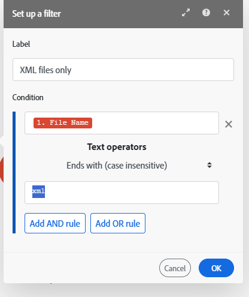

# Een filter toevoegen aan een scenario

In sommige scenario&#39;s, moet u slechts met bundels werken die aan specifieke criteria voldoen. Met filters kunt u deze bundels selecteren.

U kunt bijvoorbeeld een scenario maken met de trigger [!UICONTROL Watch records] voor Workfront om alleen taken vast te leggen die aan een specifieke gebruiker zijn toegewezen.

U kunt een filter tussen twee modules toevoegen en controleren of de bundels die van de voorafgaande modules worden ontvangen specifieke filtervoorwaarden vervullen:

* Als zij, de bundels overgaan tot de volgende module in het scenario.
* Als ze dat niet doen, wordt de verwerking voor de bundels beëindigd.

## Toegangsvereisten

+++ Breid uit om de toegangseisen voor de functionaliteit in dit artikel weer te geven.

<table style="table-layout:auto">
 <col> 
 <col> 
 <tbody> 
  <tr> 
   <td role="rowheader">Adobe Workfront-pakket</td> 
   <td> 
Elk Adobe Workfront Workflow-pakket en elk Adobe Workfront Automation and Integration-pakket

Workfront Ultimate

Workfront Prime en Select packages, met extra aanschaf van Workfront Fusion.
 </td> 
  </tr> 
  <tr data-mc-conditions=""> 
   <td role="rowheader">Adobe Workfront-licenties</td> 
   <td> 
Standard

Werk of hoger
 </td> 
  </tr> 
  <tr> 
   <td role="rowheader">Product</td> 
   <td>
   
Als uw organisatie een Select- of Prime Workfront-pakket heeft dat geen Workfront Automation and Integration bevat, moet uw organisatie Adobe Workfront Fusion aanschaffen.</li></ul>
   </td> 
  </tr>
 </tbody> 
</table>

Voor meer detail over de informatie in deze lijst, zie [&#x200B; vereisten van de Toegang in documentatie &#x200B;](/help/workfront-fusion/references/licenses-and-roles/access-level-requirements-in-documentation.md).

+++

## Vereisten

U moet beide modules aan een scenario toevoegen alvorens u een filter tussen hen kunt toevoegen.

## Voeg een filter tussen twee modules toe:

1. Klik op de tab **[!UICONTROL Scenarios]** in het linkerdeelvenster.
1. Selecteer het scenario waaraan u een filter wilt toevoegen.
1. Klik overal op het scenario om de redacteur van het Scenario in te gaan.
1. Klik het moersleutelpictogram  tussen de modules waar u een filter wilt toevoegen en **Opstelling een filter** selecteren.
1. Voer in het vak dat wordt weergegeven een **[!UICONTROL Label]** voor het filter in.
1. Definieer het filter **[!UICONTROL Condition]** .

   Typ het veld waarop u wilt filteren in het eerste veld, de operator en (indien nodig) de waarde waarmee u het veld wilt vergelijken.

   >[!TIP]
   >
   >U kunt waarden invoeren in filtervelden vanuit het deelvenster Toewijzing
   >Voor meer informatie bij afbeelding, zie [&#x200B; informatie van de Kaart van één module aan een andere &#x200B;](/help/workfront-fusion/create-scenarios/map-data/map-data-from-one-to-another.md).

   Als u bijvoorbeeld wilt dat het filter bestanden doorgeeft in Adobe Workfront die eindigen met XML, typt u **[!UICONTROL File name]** in het eerste vak en.**[!UICONTROL xml]** in het tweede vak. In het vervolgkeuzemenu ertussen selecteert u **[!UICONTROL Ends with (case insensitive)]** . Dit filter wordt toegepast op binnenkomende bundels uit de eerste module (Workfront). Alleen pakketten met XML-bestanden worden doorgegeven aan de volgende module.

   

1. Klik op **[!DNL OK]**.

## Een filter kopiëren

U kunt een bestaand filter kopiëren en elders in het scenario plakken.

1. Klik op de tab **[!UICONTROL Scenarios]** in het linkerdeelvenster.
1. Selecteer het scenario waaraan u een filter wilt toevoegen.
1. Klik overal op het scenario om de redacteur van het Scenario in te gaan.
1. Klik met de rechtermuisknop op de verbindende stippen tussen modules waar het filter zich bevindt.
1. Selecteer **filter van het Exemplaar**.
1. Klik met de rechtermuisknop op de verbindende stippen tussen modules waar u het filter wilt plakken.
1. Selecteren **Plakken, filter
1. (Facultatief) om de filter aan te passen, klik het filterpictogram of het etiket, en ga waarden in zoals die in [&#x200B; worden beschreven een filter tussen twee modules &#x200B;](#add-a-filter-between-two-modules) in dit artikel toevoegen.

<!--

Currently, the scenario editor does include a feature for copying a filter.

>[!NOTE]
>
>If you copy the modules on either side of the filter, the filter is also copied.
>
>For more information on copying modules, see [Copy modules or scenarios in Adobe Workfront Fusion](/help/workfront-fusion/create-scenarios/add-modules/copy-modules-or-scenarios.md).

To copy a filter without copying modules, you can use the Fusion DevTool

1. Click the **[!UICONTROL Scenarios]** tab in the left panel.
1. Select the scenario where you want to add a filter.
1. Click anywhere on the scenario to enter the Scenario editor.
1. Open the Fusion DevTool by clicking on the DevTool icon  near the bottom of the screen.
   
   If you do not see the DevTool icon, see [Debug a scenario](/help/workfront-fusion/manage-scenarios/debug-a-scenario.md) for instructions on opening the DevTool.
   
1. Click the **[!UICONTROL Tools]** icon  in the left side bar.

1. Click **[!UICONTROL Copy Filter]**, then configure the **[!UICONTROL Copy Filter]** tool in the right side panel:

   1. Set the **[!UICONTROL Source Module]** as the module directly after the filter you want to copy.
   1. Set the **[!UICONTROL Target Module]** as the module that you want to place the filter directly after.

1. Click **[!UICONTROL Run]**.

-->
