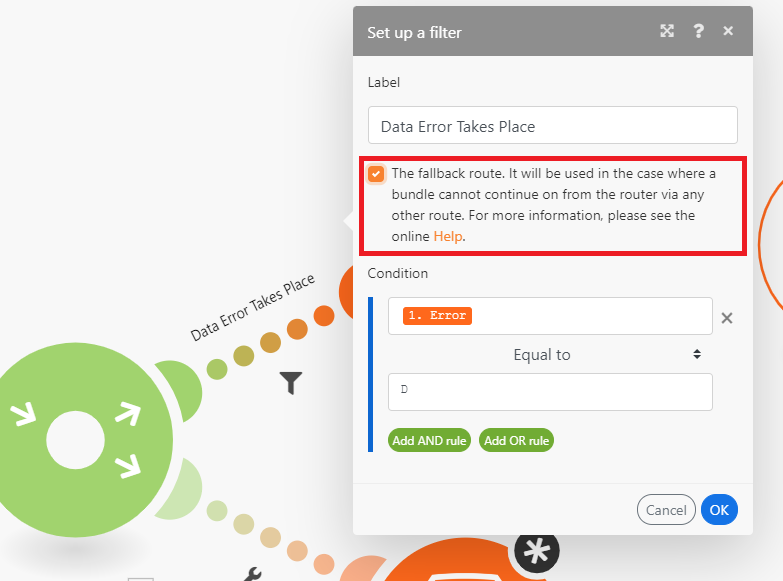
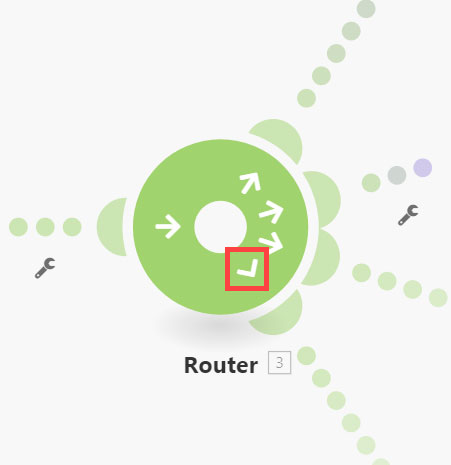

# Voeg een module van de Router toe en vorm routes

De module van de Router staat u toe om uw scenario in verscheidene routes te vertakken, en de gegevens binnen elke route verschillend te verwerken. Wanneer een module van de Router een bundel ontvangt, door:sturen het aan elke verbonden route in de orde de routes in bijlage aan de module van de Router waren.

Routes worden opeenvolgend verwerkt, niet parallel. Een bundel wordt niet verzonden naar de volgende route tot het volledig door de vorige route is verwerkt.

## Toegangsvereisten

+++ Breid uit om de toegangseisen voor de functionaliteit in dit artikel weer te geven.

<table style="table-layout:auto">
 <col> 
 <col> 
 <tbody> 
  <tr> 
   <td role="rowheader">Adobe Workfront-pakket</td> 
   <td> 
Elk Adobe Workfront Workflow-pakket en elk Adobe Workfront Automation and Integration-pakket

Workfront Ultimate

Workfront Prime en Select packages, met extra aanschaf van Workfront Fusion.
 </td> 
  </tr> 
  <tr data-mc-conditions=""> 
   <td role="rowheader">Adobe Workfront-licenties</td> 
   <td> 
Standard

Werk of hoger
 </td> 
  </tr> 
  <tr> 
   <td role="rowheader">Product</td> 
   <td>
   
Als uw organisatie een Select- of Prime Workfront-pakket heeft dat geen Workfront Automation and Integration bevat, moet uw organisatie Adobe Workfront Fusion aanschaffen.</li></ul>
   </td> 
  </tr>
 </tbody> 
</table>

Voor meer detail over de informatie in deze lijst, zie [ vereisten van de Toegang in documentatie ](/help/workfront-fusion/references/licenses-and-roles/access-level-requirements-in-documentation.md).

+++

## Add a Router module to a scenario

You must add a Router module before configuring routes.

1. Klik op de tab **[!UICONTROL Scenarios]** in het linkerdeelvenster.
1. Selecteer het scenario waar u een router wilt toevoegen.
1. Klik overal op het scenario om de redacteur van het Scenario in te gaan.
1. In de scenario redacteur, klik op het juiste handvat van de module waarna wilt u de router toevoegen, dan selecteren **[!UICONTROL Flow Control]** > **Router** in de lijst van modules die toont.

   

   of

   Om de module van de Router tussen twee modules op te nemen, klik op het moersleutelpictogram onder de route die de twee modules verbindt en selecteer **[!UICONTROL Add a router]** van het menu.

   
1. Voeg de eerste route aan de router toe door op het juiste handvat van de router te klikken en een module toe te voegen, gelijkend op het toevoegen van om het even welke module.
1. Om een andere route toe te voegen, klik de routermodule. Er wordt een route weergegeven. Voeg modules aan deze route toe zoals gewenst.

   U kunt zoveel routes toevoegen als u wilt.

1. To verify the order of the routes, check the label for each route. Route 1 executes first, then Route 2, and so on.

   of

   Klik het auto-richten pictogram .

   De routes worden geschikt in de orde zij uitvoeren. De hoogste route voert eerst uit.

1. (Facultatief) om routeorde te veranderen, klik op de module van de Router met de rechtermuisknop aan en selecteer **de routes van de Orde** Belemmering en laat vallen de routes in de orde u hen binnen wilt uitvoeren. De routes worden duidelijk door de eerste module die de router (de eerste module van de route) volgt.

   

1. Continue to [Add a filter to a route](#add-a-filter-to-a-route).

## Add a filter to a route

You can put a filter on a route after the Router module to filter bundles. Only bundles that pass through the filter will be handled by the modules on the route.

Als de gegevens de filter van meer dan één route overgaan, worden de gegevens behandeld door beide routes. De hoogste route behandelt eerst de gegevens.

De routers met filters tonen het pictogram van de filter  op het routeetiket.

1. Klik op de tab **[!UICONTROL Scenarios]** in het linkerdeelvenster.
1. Selecteer het scenario waaraan u een filter wilt toevoegen.
1. Klik overal op het scenario om de redacteur van het Scenario in te gaan.
1. Klik het moersleutelpictogram  op de weg waar u een filter wilt plaatsen. Dit is de weg tussen de routermodule en de eerste module van de route.
1. Selecteer **Opstelling een filter.**
1. Voeg een label toe in het labelveld van het deelvenster dat wordt weergegeven. Dit etiket toont in het scenario.
1. Configureer filtervoorwaarden.

   Voor meer informatie, zie [ een filter aan een scenario ](/help/workfront-fusion/create-scenarios/add-modules/add-a-filter-to-a-scenario.md) toevoegen.

1. Klik op **[!UICONTROL OK]** om de filterinstelling op te slaan.

1. Continue to [Configure a fallback route](#configure-a-fallback-route).

## Configure a fallback route

The fallback route is the route that executes on any bundles that do not pass any filter to another route.

Fallback routes display &quot;Fallback&quot; on the label.

U kunt een terugvalroute in het filterpaneel toelaten.

1. Klik op de tab **[!UICONTROL Scenarios]** in het linkerdeelvenster.
1. Selecteer het scenario waar u een reserveroute wilt toevoegen.
1. Klik overal op het scenario om de redacteur van het Scenario in te gaan.
1. Klik het moersleutelpictogram  op de weg waar u een filter wilt plaatsen. Dit is de weg tussen de routermodule en de eerste module van de route.
1. Selecteer **Opstelling een filter.**
1. Voeg een label toe in het labelveld van het deelvenster dat wordt weergegeven. Dit etiket toont in het scenario.
1. Schakel het selectievakje voor de terugvalroute in.

   

1. Klik op **[!UICONTROL OK]** om de filterinstelling op te slaan.

The Fallback route is marked with a different arrow in the Router module:

## Voorbeeld: `if/else` use case

>[!BEGINSHADEBOX]

Een typisch gebruiksgeval van de reserveroute moet de stroom met één route voortzetten als aan de voorwaarde en met een andere route wordt voldaan als het niet is. zoals in de volgende stappen:

In dit voorbeeld, wordt de eerste route gevormd met een filter. Dit vertegenwoordigt de component `if` .

The second route is configured as a fallback route. Dit vertegenwoordigt de component `else` .

>[!ENDSHADEBOX]
