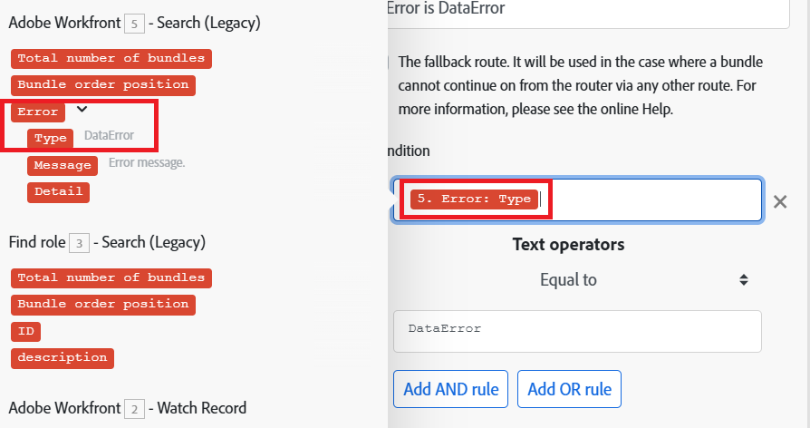

# Filteren en nesten toevoegen aan foutafhandelingsroutes

U kunt geavanceerde technieken voor foutafhandeling toevoegen aan uw foutafhandelingsroute door filteren en nesten op te nemen.

## Toegangsvereisten

+++ Breid uit om de toegangseisen voor de functionaliteit in dit artikel weer te geven.

U moet de volgende toegang hebben om de functionaliteit in dit artikel te kunnen gebruiken:

<table style="table-layout:auto">
 <col> 
 <col> 
 <tbody> 
  <tr> 
   <td role="rowheader">Adobe Workfront-pakket 
   <td> 
Alle
 </td> 
  </tr> 
  <tr data-mc-conditions=""> 
   <td role="rowheader">Adobe Workfront-licentie</td> 
   <td> 
Nieuw: Standaard

of

Huidig: Werk of hoger
 </td> 
  </tr> 
  <tr> 
   <td role="rowheader">Adobe Workfront Fusion-licentie**</td> 
   <td>
   
Huidig: Geen Workfront Fusion-licentievereisten

   
of

   
Verouderd: alle 

   </td> 
  </tr> 
  <tr> 
   <td role="rowheader">Product</td> 
   <td>
   
Nieuw:
 <ul><li>Selecteer of Prime Workfront Plan: Uw organisatie moet Adobe Workfront Fusion aanschaffen.</li><li>Ultimate Workfront Plan: Workfront Fusion is inbegrepen.</li></ul>
   
of

   
Huidig: Uw organisatie moet Adobe Workfront Fusion aanschaffen.

   </td> 
  </tr>
 </tbody> 
</table>

Voor meer detail over de informatie in deze lijst, zie [ vereisten van de Toegang in documentatie ](/help/workfront-fusion/references/licenses-and-roles/access-level-requirements-in-documentation.md).

Voor informatie over de vergunningen van de Fusie van Adobe Workfront, zie [ de Fusie van Adobe Workfront vergunningen ](/help/workfront-fusion/set-up-and-manage-workfront-fusion/licensing-operations-overview/license-automation-vs-integration.md).

+++

## Filteren

Er zijn twee soorten het filtreren die op een route van de foutenmanager kunnen plaatsvinden.

* [Voeg een filter aan de route van de foutenmanager toe](#add-a-filter-to-the-error-handler-route)
* [Voeg een Router toe die door filters aan de route van de foutenmanager wordt gevolgd](#add-a-router-followed-by-filters-to-the-error-handler)

### Voeg een filter aan de route van de foutenmanager toe

U kunt een filter gebruiken om te controleren welke fouten door de route van de foutenmanager worden behandeld. Op deze manier kunt u alleen bepaalde soorten fouten verwerken. Als een fout niet door de filter overgaat, zal het worden behandeld alsof er geen die route van de foutenmanager voor de bepaalde module wordt bepaald is.

Deze filters worden geconfigureerd zoals elk ander filter in Fusion. Voor instructies, zie [ een filter aan een scenario ](/help/workfront-fusion/create-scenarios/add-modules/add-a-filter-to-a-scenario.md) toevoegen.

### Voeg een Router toe die door filters aan de foutenmanager wordt gevolgd

Het toevoegen van een Router aan een fout behandelende route staat u toe om verschillende routes voor verschillende soorten fouten te vormen.

Bijvoorbeeld, om één route te vormen om uit te voeren wanneer de fout een DataError is, kunt u opstelling een filter dat de gegevens toestaat om over te gaan als het in kaart gebrachte foutentype aan DataError gelijk is.

Voor informatie over hoe de Fusie diverse gegevenstypes evalueert en verwerkt, zie [ types van Fout ](/help/workfront-fusion/references/errors/error-processing.md).

### Voorbeeld: foutafhandeling met filters

>[!BEGINSHADEBOX]

In dit voorbeeldscenario wordt getoond hoe deze filters werken voor foutafhandeling.

Als u Dropbox > een mappenmodule maakt gebruikt en er al een map met dezelfde naam bestaat, genereert de module een DataError:

Het volledige scenario werkt als volgt:

1. De module Opties > Variabele instellen bevat de mapnaam
1. Met HTTP > Een bestandsmodule ophalen haalt u het bestand op dat u naar de map wilt uploaden
1. Dropbox > Een mapmodule maken genereert een fout als er al een map met dezelfde naam bestaat als de map die in de module is toegewezen
1. De route van de foutenmanager (transparante bellen) bevat een router om de fouten te filtreren
De eerste route is voor een gespecificeerd type van fout genoemd `DataError`.

   1. Als een `DataError` wordt uitgevoerd en de foutgegevens door het filter worden doorgegeven, worden in Dropbox >Alle bestanden/submappen in een mappenmodule weergeven alle mappen in Dropbox weergegeven.
   1. Het volgende filter komt overeen met de mapnamen.
   1. De **1&rbrace; richtlijn van het Hervatten &lbrace;specificeert omslagidentiteitskaart en omslagweg van de bestaande omslag, en de scenario uitvoering hervat van Dropbox > creeert een omslagmodule.** In plaats van een nieuwe map te maken, gebruikt Fusion echter de waarden van de aanwijzing Hervatten om naar de volgende module te gaan en het bestand in de bestaande map te uploaden.

1. De tweede route is voor alle andere fouten en beëindigt met de richtlijn van het Terugschroeven van prijzen, die in onmiddellijk het tegenhouden van het scenario resulteert

Hieronder volgt een gedetailleerde uitleg van de route DataError.

Om de bestaande omslag in uw verdere modules, zoals te gebruiken upload een dossier, moet u een route van de foutenmanager aan de module toevoegen en de omslagweg halen die in de module moet worden in kaart gebracht van de richtlijn van het Hervatten die volgt:

 toe

Het filter op de eerste route wordt geplaatst om de bepaalde fout (DataError) slechts te behandelen die verschijnt wanneer een omslag met de zelfde naam reeds bestaat:

Dropbox > Alle bestanden in een mapmodule weergeven is geconfigureerd om alle mappen in de doelmap te retourneren. Het volgende filter geeft alleen het filter door dat we oorspronkelijk probeerden te maken. (De mapnaam wordt opgeslagen in de map 33. Mapnaam, item.)

De richtlijn van het Hervatten dan levert de weg van de Omslag als output voor de ontbroken module. De map-id is leeg gelaten omdat deze niet nodig is in de module Een bestand uploaden.

>[!ENDSHADEBOX]

## Nesten

De de managerroutes van de fout kunnen op alle modules, behalve routers worden gecreeerd en worden gevormd. Daarom kunt u een route van de foutenmanager voor een module tot stand brengen die reeds deel van een bestaande route van de foutenmanager uitmaakt.

>[!BEGINSHADEBOX]

Voorbeeld:

Een geneste fouthandlerroute met filters:

In dit scenario, wordt de tweede route van de foutenmanager genest onder de eerste route van de foutenmanager.

Als er een fout optreedt in de module Dropbox > Create a folder, gaat de uitvoering naar de eerste route. Als het filter `DataError Takes Place` wordt doorgegeven, wordt de volgende module uitgevoerd, gevolgd door de instructiemodule Hervatten als er geen fout optreedt in Dropbox > Alle bestanden/submappen in een mappenmodule weergeven.

Als er echter wel een fout optreedt in Dropbox > Alle bestanden/submappen in een mappenmodule weergeven, gaat de uitvoering naar Error Handler Route 2 en eindigt deze met de instructie [!UICONTROL Ignore] . De module [!UICONTROL Resume directive] wordt in dit geval niet uitgevoerd.

>[!ENDSHADEBOX]
