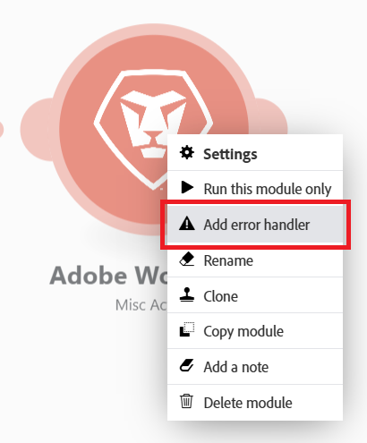

# Foutafhandeling toevoegen

Fouten kunnen optreden tijdens de uitvoering van een scenario.

Er kan bijvoorbeeld een fout optreden omdat:

* Een service is niet beschikbaar vanwege een fout
* Een service reageert met onverwachte gegevens
* Validatie van invoergegevens mislukt
* Andere redenen

Als een module een fout tijdens de scenariouitvoering ontmoet, en er geen fout behandelende route in bijlage aan de module is, voert de standaardfout behandelende logica uit.

Door een route van de foutenmanager aan een module toe te voegen, kunt u de standaardfout behandelende logica met uw vervangen. Adobe Workfront Fusion biedt vijf verschillende instructies die aan het einde van de fouthandlerroutes kunnen worden ingevoegd.

Voor meer informatie over standaardfout behandeling, zie [ de types van Fout ](/help/workfront-fusion/references/errors/error-processing.md).

Voor meer informatie over fout behandelende richtlijnen, zie [ Richtlijnen voor fout behandeling ](/help/workfront-fusion/references/errors/directives-for-error-handling.md).

## Toegangsvereisten

+++ Breid uit om de toegangseisen voor de functionaliteit in dit artikel weer te geven.

<table style="table-layout:auto">
 <col> 
 <col> 
 <tbody> 
  <tr> 
   <td role="rowheader">Adobe Workfront-pakket</td> 
   <td> 
Elk Adobe Workfront Workflow-pakket en elk Adobe Workfront Automation and Integration-pakket

Workfront Ultimate

Workfront Prime en Select packages, met extra aanschaf van Workfront Fusion.
 </td> 
  </tr> 
  <tr data-mc-conditions=""> 
   <td role="rowheader">Adobe Workfront-licenties</td> 
   <td> 
Standard

Werk of hoger
 </td> 
  </tr> 
  <tr> 
   <td role="rowheader">Product</td> 
   <td>
   
Als uw organisatie een Select- of Prime Workfront-pakket heeft dat geen Workfront Automation and Integration bevat, moet uw organisatie Adobe Workfront Fusion aanschaffen.</li></ul>
   </td> 
  </tr>
 </tbody> 
</table>

Voor meer detail over de informatie in deze lijst, zie [ vereisten van de Toegang in documentatie ](/help/workfront-fusion/references/licenses-and-roles/access-level-requirements-in-documentation.md).

+++

## Een fouthandler toevoegen

Om een foutenmanager aan een module toe te voegen:

1. Klik op de tab **[!UICONTROL Scenarios]** in het linkerdeelvenster.
1. Selecteer het scenario waar u een fout behandelende route wilt toevoegen.
1. Klik overal op het scenario om de redacteur van het Scenario in te gaan.
1. Klik met de rechtermuisknop op de module waarna u een fouthandlerroute wilt toevoegen en selecteer **[!UICONTROL Add error handler]** :

   

   Een route van de foutenmanager wordt toegevoegd aan de module. Als de module de laatste module in een route is, volgt de foutenmanager direct de module. Als de module meer modules na het heeft, wordt een afzonderlijke route van de foutenmanager toegevoegd.

   In de module voor foutafhandeling ziet u een lijst met richtlijnen en de toepassingen die in uw scenario worden gebruikt.

   

1. Selecteer een van de instructies.

   of

   Voeg één of meerdere modules aan de route van de foutenmanager toe.

   Als u meer modules aan de route toevoegt, wordt de Ignore richtlijn toegepast door gebrek. Als er een fout is, worden de verdere modules op die route verwerkt.

   Voor meer informatie over richtlijnen, zie [ Fout behandelende richtlijnen ](#error-handling-directives) in dit artikel.

1. (Optioneel) Voeg een filter toe aan de foutafhandelingsroute. Voor instructies, zie [ het filtreren en het nestelen aan fout behandelende routes ](/help/workfront-fusion/create-scenarios/config-error-handling/advanced-error-handling.md) toevoegen.

>[!NOTE]
>
>Merk op dat een route van de foutenmanager uit transparante cirkels bestaat, terwijl een regelmatige route uit stevige cirkels bestaat.

## Instructies voor foutafhandeling

De richtlijnen worden hieronder kort toegelicht. Voor meer informatie, zie [ Richtlijnen voor fout behandeling ](/help/workfront-fusion/references/errors/directives-for-error-handling.md).

Er zijn vijf richtlijnen, die in de volgende categorieën kunnen worden gegroepeerd gebaseerd op of een scenario uitvoering na de fout voortgaat.

De volgende richtlijnen zorgen ervoor dat de uitvoering van een scenario wordt voortgezet:

* **[!UICONTROL Resume]**: Hiermee kunt u een vervangende uitvoer voor de module opgeven met de fout. De status van de uitvoering van het scenario is gemarkeerd als geslaagd.
* **[!UICONTROL Ignore]** : negeert de fout. De status van de uitvoering van het scenario is gemarkeerd als geslaagd.
* **[!UICONTROL Break]**: slaat de invoer in de wachtrij van onvolledige uitvoeringen op. De status van de uitvoering van het scenario wordt gemarkeerd als waarschuwing.

  Voor meer informatie, zie [ Mening en los onvolledige uitvoeringen ](/help/workfront-fusion/manage-scenarios/view-and-resolve-incomplete-executions.md) op.

Als de uitvoering van een scenario moet stoppen wanneer een fout optreedt, gebruikt u een van de volgende instructies:

* **[!UICONTROL Rollback]**: stopt de uitvoering van het scenario onmiddellijk en markeert de status als fout.
* **[!UICONTROL Commit]**: stopt de uitvoering van het scenario onmiddellijk en markeert de status als geslaagd.

## Bronnen

Zie voor meer informatie over foutafhandeling:

* [Richtlijnen voor foutafhandeling in Adobe Workfront Fusion](/help/workfront-fusion/references/errors/directives-for-error-handling.md)
* [Filteren en nesten toevoegen aan foutafhandelingsroutes](/help/workfront-fusion/create-scenarios/config-error-handling/advanced-error-handling.md)
