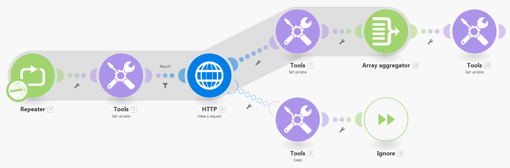

# Workaround voor foutafhandeling van `retry` configureren

Soms, is het nuttig om een falende module opnieuw uit te voeren als er een kans is dat de reden voor de mislukking snel zou kunnen oplossen.

Adobe Workfront Fusion biedt momenteel geen aanwijzing voor foutafhandeling van `retry` , maar er zijn twee tijdelijke oplossingen beschikbaar om de functionaliteit van `retry` te simuleren.

## Toegangsvereisten

+++ Breid uit om de toegangseisen voor de functionaliteit in dit artikel weer te geven.

U moet de volgende toegang hebben om de functionaliteit in dit artikel te kunnen gebruiken:

<table style="table-layout:auto">
 <col> 
 <col> 
 <tbody> 
  <tr> 
   <td role="rowheader">Adobe Workfront-pakket 
   <td> 
Alle
 </td> 
  </tr> 
  <tr data-mc-conditions=""> 
   <td role="rowheader">Adobe Workfront-licentie</td> 
   <td> 
Nieuw: Standaard

of

Huidig: Werk of hoger
 </td> 
  </tr> 
  <tr> 
   <td role="rowheader">Adobe Workfront Fusion-licentie**</td> 
   <td>
   
Huidig: Geen Workfront Fusion-licentievereisten.

   
of

   
Verouderd: alle 

   </td> 
  </tr> 
  <tr> 
   <td role="rowheader">Product</td> 
   <td>
   
Nieuw:
 <ul><li>Selecteer of Prime Workfront Plan: Uw organisatie moet Adobe Workfront Fusion aanschaffen.</li><li>Ultimate Workfront Plan: Workfront Fusion is inbegrepen.</li></ul>
   
of

   
Huidig: Uw organisatie moet Adobe Workfront Fusion aanschaffen.

   </td> 
  </tr>
 </tbody> 
</table>

Voor meer detail over de informatie in deze lijst, zie [ vereisten van de Toegang in documentatie ](/help/workfront-fusion/references/licenses-and-roles/access-level-requirements-in-documentation.md).

Voor informatie over de vergunningen van de Fusie van Adobe Workfront, zie [ de Fusie van Adobe Workfront vergunningen ](/help/workfront-fusion/set-up-and-manage-workfront-fusion/licensing-operations-overview/license-automation-vs-integration.md).

+++

## Problemen met de aanwijzing voor foutafhandeling van [!UICONTROL Retry]

Workfront Fusion biedt momenteel geen aanwijzing voor foutafhandeling van `retry` . Gebruik een van de volgende tijdelijke oplossingen om de functionaliteit voor opnieuw proberen na te bootsen.

Voor instructies, zie [ Richtlijnen voor fout behandeling ](/help/workfront-fusion/references/errors/directives-for-error-handling.md).

* [De instructie Break gebruiken](#use-the-break-directive)
* [De module Repeater gebruiken](#use-the-repeater-module)

### De instructie Break gebruiken

Wanneer de instructie Break wordt uitgevoerd, wordt de status van de uitvoering van het scenario opgeslagen in de wachtrij met onvolledige uitvoeringen. Als dit gebeurt, kunt u de onvolledige uitvoering vervolgens handmatig oplossen.

Voor instructies zie [ fouten oplossen die door de richtlijn van het Onderbreking ](/help/workfront-fusion/create-scenarios/config-error-handling/resolve-error-from-break-directive.md) worden behandeld

Voor instructies bij het oplossen van onvolledige uitvoeringen, zie [ Mening en los onvolledige uitvoeringen ](/help/workfront-fusion/manage-scenarios/view-and-resolve-incomplete-executions.md) op.

#### Nadelen

* Het minimale interval voor opnieuw proberen is één minuut.
* Als de module meerdere bundels verwerkt en de verwerking van een bundel mislukt, wordt de gedeeltelijke uitvoering (alleen de bundel die de fout heeft veroorzaakt) verplaatst naar de onvolledige map voor uitvoeringen en wordt deze gepland voor nieuwe pogingen volgens de instellingen van de instructie [!UICONTROL Break] . Nochtans, gaat de huidige uitvoering verder en de module blijft de verdere bundels verwerken.

  Als u wilt voorkomen dat het scenario opnieuw wordt uitgevoerd totdat de uitvoering in de map Onvolledige uitvoeringen is opgelost, schakelt u de optie &quot;[!UICONTROL Sequential processing]&quot; in [!UICONTROL Scenario settings] in.

Voor meer informatie over onvolledige uitvoeringen, zie [ Mening en los onvolledige uitvoeringen ](/help/workfront-fusion/manage-scenarios/view-and-resolve-incomplete-executions.md) op.

### De module Repeater gebruiken

De oplossing van de module Repeater is complexer, maar aanpasbaar.

#### Vorm de route van de foutenmanager

1. Klik op de tab **[!UICONTROL Scenarios]** in het linkerdeelvenster.
1. Selecteer het scenario waar u de tijdelijke oplossing wilt toevoegen.
1. Klik overal op het scenario om de redacteur van het Scenario in te gaan.
1. Klik de **controle van de Stroom** pictogram  en selecteer **Repeater**.
1. Stel in de module Repeater het veld **[!UICONTROL Repeats]** in op het maximumaantal keren dat het scenario opnieuw moet proberen.
1. Koppel de module die mogelijk mislukt na de module **[!UICONTROL Repeater]** .
1. Verbind een route van de foutenmanager aan de potentieel ontbrekende module.

   Voor instructies, zie [ fout behandeling ](/help/workfront-fusion/create-scenarios/config-error-handling/error-handling.md) toevoegen.
1. Voeg de module **[!UICONTROL Tools]>[!UICONTROL Sleep]** toe aan de fouthandlerroute en stel het veld **[!UICONTROL Delay]** ervan in op het aantal seconden tussen pogingen om het opnieuw uit te proberen.

1. Voeg de aanwijzing **[!UICONTROL Ignore]** toe na de module **[!UICONTROL Tools]>[!UICONTROL Sleep]** .
1. Ga aan [ verder vormen de standaardroute ](#configure-the-default-route).

#### Vorm de standaardroute

1. Voeg de module **[!UICONTROL Tools]>[!UICONTROL Set variable]** toe in een afzonderlijke (niet-fout-handler) route na de mogelijk mislukte module en configureer deze om het resultaat van de module op te slaan in een variabele met de naam `Result` .

1. Voeg de module **[!UICONTROL Array aggregator]** toe na **[!UICONTROL Tools]>[!UICONTROL Set variable]** en selecteer de module **[!DNL Repeater]** in het veld Source Module.

1. Voeg de module **[!UICONTROL Tools]>[!UICONTROL Get variable]** toe na de module **[!UICONTROL Array aggregator]** en wijs de waarde van de variabele `Result` hieraan toe.

1. Voeg de module **[!UICONTROL Tools]>[!UICONTROL Get variable]** in tussen de module **[!UICONTROL Repeater]** en de module die mogelijk niet werkt en wijs de waarde van de variabele `Result` hieraan toe.

1. Voeg een filter in tussen deze module **[!UICONTROL Tools]>[!UICONTROL Get variable]** en de module die mogelijk niet werkt, alleen als de variabele `Result` niet bestaat.

>[!BEGINSHADEBOX]

**Voorbeeld:**

In dit voorbeeldscenario vertegenwoordigt de module [!UICONTROL HTTP] > [!UICONTROL Make a request] de module die mogelijk mislukt:

>[!ENDSHADEBOX]

Als het resultaat van de potentieel falende module te complex is om in een eenvoudige variabele worden opgeslagen, kunt u een gegevensopslag gebruiken om het resultaat op te slaan en terug te winnen. De gegevensopslag zou slechts één record bevatten. De sleutel van de record kan bijvoorbeeld `Result` zijn.

Voor meer informatie over gegevensopslag, zie [ de Opslag van Gegevens ](/help/workfront-fusion/create-scenarios/map-data/data-stores.md).

#### Nadelen

* Deze oplossing is complexer.
* Deze tijdelijke oplossing gebruikt meer bewerkingen.

## Bronnen

* Voor meer informatie over de modules van de Repeater en break instructies, zie [ controle van de Stroom ](/help/workfront-fusion/references/apps-and-modules/tools-and-transformers/flow-control.md).
* Voor meer informatie over krijgen de Modules van de Variabele, zie [ Hulpmiddelen ](/help/workfront-fusion/references/apps-and-modules/tools-and-transformers/tools-modules.md).
