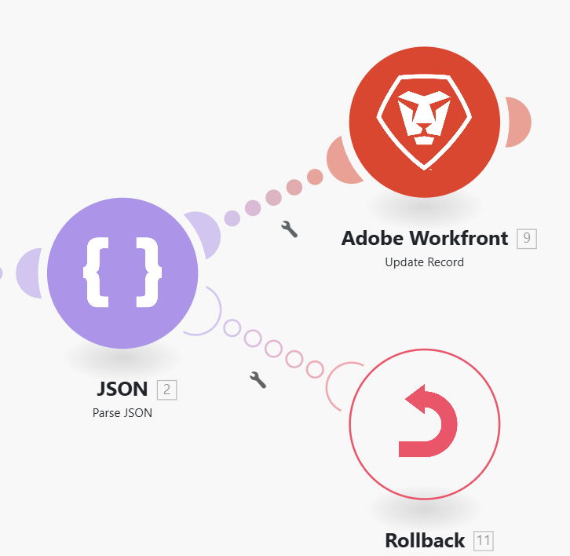

# Oplossing voor een fout configureren `throw`

In sommige gevallen, kunt u de scenario-uitvoering die door Terugdraaiing of Vastleggingsfase wordt gevolgd forceren willen tegenhouden, of de verwerking van een route ophouden en naar keuze het in de rij van onvolledige uitvoeringen opslaan.

Momenteel, kunnen de fout behandelende richtlijnen niet buiten het werkingsgebied van een foutenhandlerroute worden gebruikt, en Adobe Workfront Fusion biedt geen module aan die u zou toelaten om (werpen) fouten gemakkelijk voorwaardelijk te produceren.

U kunt de volgende tijdelijke oplossing gebruiken om de foutfunctionaliteit van `throw` na te bootsen.

Voor informatie over onvolledige uitvoeringen, zie [ Mening en los onvolledige uitvoeringen in de Fusie van Adobe Workfront ](/help/workfront-fusion/manage-scenarios/view-and-resolve-incomplete-executions.md) op.

Voor informatie over fout behandelende richtlijnen, zie [ Richtlijnen voor fout behandeling in de Fusie van Adobe Workfront ](/help/workfront-fusion/references/errors/directives-for-error-handling.md).

## Toegangsvereisten

+++ Breid uit om de toegangseisen voor de functionaliteit in dit artikel weer te geven.

U moet de volgende toegang hebben om de functionaliteit in dit artikel te kunnen gebruiken:

<table style="table-layout:auto">
 <col> 
 <col> 
 <tbody> 
  <tr> 
   <td role="rowheader">Adobe Workfront-pakket 
   <td> 
Alle
 </td> 
  </tr> 
  <tr data-mc-conditions=""> 
   <td role="rowheader">Adobe Workfront-licentie</td> 
   <td> 
Nieuw: Standaard

of

Huidig: Werk of hoger
 </td> 
  </tr> 
  <tr> 
   <td role="rowheader">Adobe Workfront Fusion-licentie**</td> 
   <td>
   
Huidig: Geen Workfront Fusion-licentievereisten

   
of

   
Verouderd: alle 

   </td> 
  </tr> 
  <tr> 
   <td role="rowheader">Product</td> 
   <td>
   
Nieuw:
 <ul><li>Selecteer of Prime Workfront Plan: Uw organisatie moet Adobe Workfront Fusion aanschaffen.</li><li>Ultimate Workfront Plan: Workfront Fusion is inbegrepen.</li></ul>
   
of

   
Huidig: Uw organisatie moet Adobe Workfront Fusion aanschaffen.

   </td> 
  </tr>
 </tbody> 
</table>

Voor meer detail over de informatie in deze lijst, zie [ vereisten van de Toegang in documentatie ](/help/workfront-fusion/references/licenses-and-roles/access-level-requirements-in-documentation.md).

Voor informatie over de vergunningen van de Fusie van Adobe Workfront, zie [ de Fusie van Adobe Workfront vergunningen ](/help/workfront-fusion/set-up-and-manage-workfront-fusion/licensing-operations-overview/license-automation-vs-integration.md).

+++

## Oplossing voor `throw`

Om een fout voorwaardelijk te werpen, kunt u een module vormen om het opzettelijk tijdens zijn verrichting te maken ontbreken. U kunt bijvoorbeeld de module [!UICONTROL JSON] > [!UICONTROL Parse JSON] gebruiken, die is geconfigureerd om optioneel een fout te genereren (`BundleValidationError` in dit geval):

Vervolgens kunt u een van de foutafhandelingsinstructies aan de foutafhandelingsroute koppelen:

* **Terugdraaiing**: Drijf de scenariouitvoering om de terugdraaifase te stoppen en uit te voeren.
* **begaat**: Dwing de scenario uitvoering om te stoppen en uit te voeren begaan fase.
* **negeert**: Stop de verwerking van een route.
* **Breek**: Stop de verwerking van een route en sla het in de rij van onvolledige uitvoeringenomslag op.

In het volgende voorbeeld wordt het gebruik van de instructie [!DNL Rollback] getoond:

