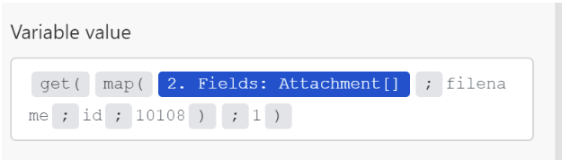

# Een array- of arrayelement toewijzen

Een array is een bundelitem dat het volgende kan bevatten:

* Een of meer waarden van hetzelfde type (eenvoudige array)
* Een of meer verzamelingen van hetzelfde type (complexe array)

>[!BEGINSHADEBOX]

**Voorbeeld:**

* **Complexe serie**: De [!UICONTROL Watch emails] module keert een serie van gehechtheid voor elke e-mail terug. Elke bijlage vertegenwoordigt een verzameling die een naam, inhoud, grootte enzovoort kan bevatten.

>[!ENDSHADEBOX]

## Toegangsvereisten

+++ Breid uit om de toegangseisen voor de functionaliteit in dit artikel weer te geven.

<table style="table-layout:auto">
 <col> 
 <col> 
 <tbody> 
  <tr> 
   <td role="rowheader">Adobe Workfront-pakket</td> 
   <td> 
Elk Adobe Workfront Workflow-pakket en elk Adobe Workfront Automation and Integration-pakket

Workfront Ultimate

Workfront Prime en Select packages, met extra aanschaf van Workfront Fusion.
 </td> 
  </tr> 
  <tr data-mc-conditions=""> 
   <td role="rowheader">Adobe Workfront-licenties</td> 
   <td> 
Standard

Werk of hoger
 </td> 
  </tr> 
  <tr> 
   <td role="rowheader">Product</td> 
   <td>
   
Als uw organisatie een Select- of Prime Workfront-pakket heeft dat geen Workfront Automation and Integration bevat, moet uw organisatie Adobe Workfront Fusion aanschaffen.</li></ul>
   </td> 
  </tr>
 </tbody> 
</table>

Voor meer detail over de informatie in deze lijst, zie [ vereisten van de Toegang in documentatie ](/help/workfront-fusion/references/licenses-and-roles/access-level-requirements-in-documentation.md).

+++

## Een volledige array toewijzen

1. Klik op de tab **[!UICONTROL Scenarios]** in het linkerdeelvenster.
1. Selecteer het scenario waarin u een array wilt toewijzen.
1. Klik overal op het scenario om de redacteur van het Scenario in te gaan.
1. Klik in de module waaraan u de array wilt toewijzen, op het veld waar u de array wilt toewijzen. Dit is het veld waaraan de array wordt toegewezen.

1. Wijs het item toe in het vak dat wordt weergegeven.

   In het deelvenster kunt u velden op dezelfde manier toewijzen als bij elk ander type item. Als u niet elk item afzonderlijk wilt invullen, maar een andere array wilt toewijzen aan het doelveld, gebruikt u de knop [!UICONTROL Map] . In dit geval moet u ervoor zorgen dat beide arrays (de bronarray en de doelarray) dezelfde structuur hebben.

   U kunt elk gewenst aantal items aan een array toevoegen.

U kunt een array in afzonderlijke bundels verdelen met behulp van een iterator. Zie [[!UICONTROL Iterator] module in Adobe Workfront Fusion ](/help/workfront-fusion/references/modules/iterator-module.md) voor meer informatie.

## Items toewijzen aan een nieuwe array

Met sommige velden in Workfront Fusion kunt u elementen toewijzen aan een array. U kunt bijvoorbeeld een array met items in de checklist maken in de Workfront Boards > Add checklist item module. Wanneer de module wordt uitgevoerd, worden alle items in de controlelijst aan de kaart toegevoegd.

Om het even welk modulegebied dat &quot;Add punt&quot;toont leidt tot een serie.

 toe

Elementen toevoegen aan de array:

1. Klik **toevoegen punt**
1. Voer in het deelvenster dat wordt geopend details in over het item.
1. Klik **toevoegen**.
1. (Facultatief) herhaal stappen 1-3 voor elk element u aan de  serie wilt toevoegen.

## Matrixelementen toewijzen

### Array-elementen toewijzen op nummer

Array-elementen worden tussen vierkante haakjes weergegeven als een getal na de naam van de array. Met dit indexnummer kunt u een afzonderlijk element van een array in een veld toewijzen.

>[!NOTE]
>
>Array-indexering in Workfront Fusion begint bij 1.

Een arrayelement toewijzen:

1. Klik op het veld waar u het element wilt toewijzen.

   Het deelvenster Toewijzing wordt geopend.

1. Zoek de array met het element dat u wilt toewijzen.
1. Klik op de vervolgkeuzepijl naast de array.
1. Klik op het element dat u wilt toewijzen.

   Het element wordt toegewezen, met index 1. Hierdoor wordt het eerste element in de array toegewezen.

1. Om een verschillend element van de serie in kaart te brengen, klik op [ 1 ] en ga het indexaantal van het serieelement in dat u wilt in kaart brengen.

   

### Het element van een array toewijzen met een bepaalde sleutel

Sommige arrays bevatten verzamelingen met sleutelwaardeitems, zoals metagegevens, kenmerken, enzovoort. Als u een van deze waarden wilt gebruiken, kunt u een element opzoeken op basis van de opgegeven sleutelwaarde en de bijbehorende waarde ophalen uit het waardeitem. We raden u aan een formule te gebruiken die een combinatie van de functies `map()` en `get()` gebruikt.

>[!BEGINSHADEBOX]

In het volgende voorbeeld wordt de uitvoer van de [!DNL Jira] App getoond.

In dit voorbeeld wordt een bestandsnaam opgehaald uit een array van bijlagen, voor de specifieke bijlage met een id van 10108.

In dit voorbeeld wordt de volgende uitvoer gegenereerd:

De formule kan als volgt worden toegelicht:

* `map`

   1. De eerste parameter van de functie `map()` is het gehele arrayitem.
   1. De tweede parameter is de onbewerkte naam van het waardeitem. Als u de onbewerkte naam wilt verkrijgen, plaatst u de muisaanwijzer op het item in het deelvenster [!UICONTROL mapping] :

      

      >[!NOTE]
      >
      >Alle parameters zijn hoofdlettergevoelig. Hoewel in dit voorbeeld het label van het item alleen in hoofdletters verschilt van de onbewerkte naam, is het nodig de onbewerkte naam te gebruiken.

   1. De derde parameter is de onbewerkte naam van het sleutelitem:

      

   1. De vierde parameter is de opgegeven sleutelwaarde.

  Omdat de functie `map()` een array retourneert (omdat er meer elementen met de opgegeven sleutelwaarde kunnen zijn), is het nodig de functie `get()` toe te passen om het eerste element op te halen:

* `get`

   1. De eerste parameter van de functie `get()` is het resultaat van de functie `map()` .

   1. De tweede parameter is de index van het element. In dit voorbeeld is de index `1` .

In dit voorbeeld wordt de volgende uitvoer gegenereerd:

>[!ENDSHADEBOX]

Voor meer informatie over de `map()` functie, zie [ functies van de Serie ](/help/workfront-fusion/references/mapping-panel/functions/array-functions.md).

Voor meer informatie over de `get()` functie, zie [ Algemene functies ](/help/workfront-fusion/references/mapping-panel/functions/general-functions.md).

## Arrayelementen omzetten in een reeks bundels

Arrays kunnen met de module [!UICONTROL Iterator] worden omgezet in een reeks bundels. Zie [[!UICONTROL Iterator] module ](/help/workfront-fusion/references/modules/iterator-module.md) voor meer informatie.

