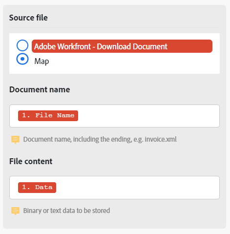

# Een bestand toewijzen tussen modules

Sommige modules kunnen bestanden verwerken. Deze modules kunnen een uitvoerbestand retourneren dat voor verdere verwerking moet worden verzonden, of een bestand vereisen dat voor verwerking aan hen wordt doorgegeven. Bestanden kunnen me worden toegewezen, zodat een bestandsuitvoer door de ene module kan worden verwerkt door een andere module.

## Toegangsvereisten

+++ Breid uit om de toegangseisen voor de functionaliteit in dit artikel weer te geven.

U moet de volgende toegang hebben om de functionaliteit in dit artikel te kunnen gebruiken:

<table style="table-layout:auto">
 <col> 
 <col> 
 <tbody> 
  <tr> 
   <td role="rowheader">[!DNL Adobe Workfront] package</td> 
   <td> 
Alle
 </td> 
  </tr> 
  <tr data-mc-conditions=""> 
   <td role="rowheader">[!DNL Adobe Workfront] licentie</td> 
   <td> 
Nieuw: [!UICONTROL Standard]

of

Huidig: [!UICONTROL Work] of hoger
 </td> 
  </tr> 
  <tr> 
   <td role="rowheader">[!DNL Adobe Workfront Fusion] licentie**</td> 
   <td>
   
Huidig: Geen [!DNL Workfront Fusion] vereiste licentie.

   
of

   
Verouderd: alle 

   </td> 
  </tr> 
  <tr> 
   <td role="rowheader">Product</td> 
   <td>
   
Nieuw:
 <ul><li>[!UICONTROL Select] of [!UICONTROL Prime] [!DNL Workfront] -abonnement: uw organisatie moet het abonnement aanschaffen [!DNL Adobe Workfront Fusion] .</li><li>[!UICONTROL Ultimate] [!DNL Workfront] abonnement: [!DNL Workfront Fusion] is opgenomen.</li></ul>
   
of

   
Huidig: Uw organisatie moet [!DNL Adobe Workfront Fusion] aanschaffen.

   </td> 
  </tr>
  <tr data-mc-conditions=""> 
   <td role="rowheader">Configuraties op toegangsniveau*</td> 
   <td> 
     
U moet een [!DNL Workfront Fusion] beheerder voor uw organisatie zijn.

     
U moet een [!DNL Workfront Fusion] beheerder voor uw team zijn.

   </td> 
  </tr> 
   </td> 
  </tr> 
 </tbody> 
</table>

Voor meer detail over de informatie in deze lijst, zie [ vereisten van de Toegang in documentatie ](/help/workfront-fusion/references/licenses-and-roles/access-level-requirements-in-documentation.md).

Voor informatie over [!DNL Adobe Workfront Fusion] vergunningen, zie [[!DNL Adobe Workfront Fusion]  vergunningen ](/help/workfront-fusion/set-up-and-manage-workfront-fusion/licensing-operations-overview/license-automation-vs-integration.md).

+++

## Bestanden van bronmodules toewijzen aan doelmodules

De modules kunnen dossiers verwerken vereisen twee stukken van informatie:

* Bestandsnaam
* Bestandsinhoud (gegevens)

Als om het even welke vorige modules een dossier uitvoeren, kunt u de bronmodule selecteren, en de naam en de gegevens van de dossieroutput door die module worden in kaart gebracht aan de doelmodule.

U kunt deze naam en gegevens ook handmatig invoeren of toewijzen vanuit vorige modules. Dit kan handig zijn wanneer u bijvoorbeeld de naam van een bestand wijzigt.

>[!NOTE]
>
>Als u een bestand vanaf een URL moet verwerken, raden we u aan het bestand met de module `HTTP > Get a File` te downloaden van de URL en het bestand vervolgens van de module `HTTP > Get a File` toe te wijzen aan het veld van de gewenste module in uw scenario.
>
>

Een bestand toewijzen:

1. Klik op de tab **[!UICONTROL Scenarios]** in het linkerdeelvenster.
1. Selecteer het scenario waarin u een bestand wilt toewijzen.
1. Klik overal op het scenario om de redacteur van het Scenario in te gaan.
1. In de doelmodule, die het doel is u aan in kaart brengt, bepaal de plaats van het **dossier van Source** gebied.
1. Als u een bestandsuitvoer wilt toewijzen door een vorige module, selecteert u de module die het bestand uitvoert.

   

1. Als u de naam en gegevens handmatig wilt toewijzen, selecteert u Kaart en voert u de naam en gegevens van het bestand in of wijst u deze toe.

   

1. Ga verder vormend de module, of klik **O.K.**.
