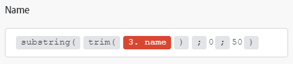

# Een item toewijzen met behulp van functies

Wanneer u items toewijst, kunt u functies gebruiken om eenvoudige of complexe formules te maken. De beschikbare functies zijn vergelijkbaar met functies in Excel en in sommige programmeertalen:

* Ze evalueren algemene logica, wiskunde, tekst, datums en arrays.
* U kunt hiermee voorwaardelijke logica en transformaties van itemwaarden uitvoeren, zoals het omzetten van tekst in hoofdletters, het bijsnijden van tekst, het omzetten van een datum in een andere notatie en nog veel meer.

## Toegangsvereisten

+++ Breid uit om de toegangseisen voor de functionaliteit in dit artikel weer te geven.

U moet de volgende toegang hebben om de functionaliteit in dit artikel te kunnen gebruiken:

<table style="table-layout:auto">
 <col> 
 <col> 
 <tbody> 
  <tr> 
   <td role="rowheader">Adobe Workfront-pakket</td> 
   <td> 
Alle
 </td> 
  </tr> 
  <tr data-mc-conditions=""> 
   <td role="rowheader">Adobe Workfront-licentie</td> 
   <td> 
Nieuw: Standaard

of

Huidig: [!UICONTROL Work] of hoger
 </td> 
  </tr> 
  <tr> 
   <td role="rowheader">Adobe Workfront Fusion-licentie**</td> 
   <td>
   
Huidig: Geen Workfront Fusion-licentievereisten.

   
of

   
Verouderd: alle 

   </td> 
  </tr> 
  <tr> 
   <td role="rowheader">Product</td> 
   <td>
   
Nieuw:
 <ul><li>[!UICONTROL Select] of [!UICONTROL Prime] Workfront-abonnement: uw organisatie moet Adobe Workfront Fusion aanschaffen.</li><li>[!UICONTROL Ultimate] Workfront-abonnement: Workfront Fusion is inbegrepen.</li></ul>
   
of

   
Huidig: Uw organisatie moet Adobe Workfront Fusion aanschaffen.

   </td> 
  </tr>
  <tr data-mc-conditions=""> 
   <td role="rowheader">Configuraties op toegangsniveau*</td> 
   <td> 
     
U moet een Workfront Fusion-beheerder zijn voor uw organisatie.

     
U moet een Workfront Fusion-beheerder zijn voor uw team.

   </td> 
  </tr> 
   </td> 
  </tr> 
 </tbody> 
</table>

Voor meer detail over de informatie in deze lijst, zie [&#x200B; vereisten van de Toegang in documentatie &#x200B;](/help/workfront-fusion/references/licenses-and-roles/access-level-requirements-in-documentation.md).

Voor informatie over de vergunningen van de Fusie van Adobe Workfront, zie [&#x200B; de Fusie van Adobe Workfront vergunningen &#x200B;](/help/workfront-fusion/set-up-and-manage-workfront-fusion/licensing-operations-overview/license-automation-vs-integration.md).

+++

## Functies invoegen in velden

Een functie invoegen in een veld:

1. Klik op de tab **[!UICONTROL Scenarios]** in het linkerdeelvenster.
1. Selecteer het scenario waarin u gegevens wilt toewijzen.
1. Klik overal op het scenario om de redacteur van het Scenario in te gaan.
1. Klik op het veld waar u een functie wilt invoegen.
1. Selecteer in het deelvenster Toewijzing het tabblad met de functie die u wilt invoegen.

   Voor informatie bij het in kaart brengen van paneellusjes, zie [&#x200B; Overzicht van de Functie &#x200B;](/help/workfront-fusion/get-started-with-fusion/understand-fusion/function-overview.md)
   1. Klik op de naam van de functie.

      of

      Sleep de functie naar het veld.
1. Configureer de functieparameters.

   Houd de muisaanwijzer boven de functie in het deelvenster Toewijzing voor een uitleg van functieparameters.

   Voor meer informatie over functies en hun parameters, zie de artikelen onder [&#x200B; Verwijzingen van de Functie: artikelindex &#x200B;](/help/workfront-fusion/references/mapping-panel/functions/functions-toc.md).

1. Ga verder vormend de module, of klik **O.K.**.

>[!TIP]
>
>Wanneer u een complexe formule maakt die u opnieuw wilt gebruiken in een ander veld, kunt u klikken op het veld dat de combinatie bevat, Cmd-A of Ctrl-A gebruiken om de combinatie te selecteren en vervolgens kopiëren en in het andere veld plakken.

>[!BEGINSHADEBOX]

**Voorbeeld:** Sommige gegevenstypes verhinderen gebruikers meer dan een bepaald aantal karakters in te gaan. U kunt de subtekenreeksfunctie gebruiken om een waarde te beperken tot een bepaald aantal tekens.

In dit voorbeeld beperkt de subtekenreeksfunctie de projectnaam tot 50 tekens.

>[!ENDSHADEBOX]

## Nesten, functies

U kunt functies binnen elkaar nesten.

>[!BEGINSHADEBOX]

**Voorbeeld:**

In dit voorbeeld beperkt de subtekenreeksfunctie de bijgesneden projectnaam tot 50 tekens.

>[!ENDSHADEBOX]

Een functie nesten:

1. Klik op het veld waar u een formule maakt.

   Hiermee opent u het deelvenster Toewijzing.

1. Klik op de eerste functie die u wilt toevoegen. Dit is de functie aan de buitenkant. In het volgende voorbeeld is dit de functie `substring` .
1. Klik in die functie op de plaats waar de geneste functie naartoe moet. In dit voorbeeld gaat de geneste functie naar de plaats van de eerste parameter.
1. Klik in het deelvenster Toewijzing op de geneste functie. In dit voorbeeld is dit de functie `trim` .
1. Ga door met het configureren van de functie.
1. Ga verder vormend de module, of klik **O.K.**.

## [!DNL Google Sheets] -functies gebruiken

Als Workfront Fusion geen functie heeft die u wilt gebruiken, maar die door [!DNL Google Sheets] wordt aanbevolen, kunt u deze als volgt gebruiken:

1. Maak in [!DNL Google Sheets] een nieuw leeg spreadsheet.
1. Open uw scenario in Workfront Fusion.
1. Voeg de module **[!DNL Google Sheets]** > **[!UICONTROL Update a cell]** aan het scenario toe.

1. Configureer de module:

   1. Kies het nieuwe werkblad in het veld **[!UICONTROL Spreadsheet]** .
   1. Voeg uw formule met de [!DNL Google Sheets] functie(s) in het **[!UICONTROL Value]** veld in.

      U kunt de output van voorafgaande modules zoals gebruikelijk gebruiken.

      

1. Voeg de module **[!UICONTROL Google Sheets]>[!UICONTROL Get a cell]** in om het berekende resultaat te verkrijgen.
1. Vorm de module, gebruikend zelfde identiteitskaart van de Cel die u in stap 4 gebruikte.

   
