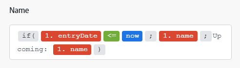

# Overzicht van toewijzing

Toewijzing is het toewijzen van de uitvoer van een module aan de invoervelden van een andere module.

De verrichting van een module veroorzaakt nul, één, of meer bundels als zijn output. Een bundel bestaat uit een of meer items.

U kunt deze punten aan gebieden in recentere modules in kaart brengen.

Als u in een scenario op een veld klikt waarin u een waarde kunt invoegen die is uitgevoerd vanuit een voorgaande module, wordt het deelvenster Toewijzing weergegeven. Hier kunt u het item selecteren dat u wilt toewijzen. Een toewijzing kan één of meerdere van het volgende omvatten:

* Eén item
* Meerdere items
* Statische tekst
* Functies

>[!BEGINSHADEBOX]

**Voorbeelden**:

Eén item

Meerdere items met tekst

Functie met meerdere items en tekst

>[!ENDSHADEBOX]

Voor instructies op afbeelding, zie de artikelen onder [&#x200B; gegevens van de Kaart: artikelindex &#x200B;](/help/workfront-fusion/create-scenarios/map-data/map-data-toc.md).

>[!NOTE]
>
>De uitvoer van modules tussen een [!UICONTROL Iterator] en [!UICONTROL Aggregator] is niet toegankelijk buiten de module [!UICONTROL Aggregator] .

## Het deelvenster Toewijzing

Wanneer u in een veld klikt waarin u gegevens kunt toewijzen, wordt het deelvenster Toewijzing geopend.

Het eerste lusje  toont de punten die u van andere modules kunt in kaart brengen.

De andere tabbladen bevatten functies, operatoren en trefwoorden die u kunt gebruiken om formules te maken. Deze worden in verschillende tabbladen gesorteerd op basis van het type gegevens dat ze verwerken.

Voor meer informatie over functielusjes, zie [&#x200B; Overzicht van de Functie &#x200B;](/help/workfront-fusion/get-started-with-fusion/understand-fusion/function-overview.md).

Voor meer informatie bij het in kaart brengen van punten die functies gebruiken, zie [&#x200B; punten van de Kaart gebruikend functies &#x200B;](/help/workfront-fusion/create-scenarios/map-data/map-using-functions.md).

## Verzamelingen

Items kunnen meerdere waarden van verschillende typen bevatten. Dit zijn verzameling-type items.

Het verzameling-type bundels geeft `(Collection)` weer naast het bundellabel in de moduleuitvoer.

In de meeste gevallen, wijst u de elementen van de inzameling in kaart in plaats van het punt in kaart te brengen dat de volledige inzameling vertegenwoordigt.

Als u het element van een verzameling wilt zoeken in het deelvenster Toewijzing, klikt u op de pijl naast de verzameling.

Voor meer informatie over inzamelingen, zie {de gegevenstypes van 0} Punt [&#128279;](/help/workfront-fusion/references/mapping-panel/data-types/item-data-types.md).

Voor instructies op afbeeldingsinzamelingen, zie [&#x200B; een punt &#x200B;](/help/workfront-fusion/create-scenarios/map-data/map-data-from-one-to-another.md#map-an-item) in de informatie van de artikelKaart van één module aan een andere in kaart brengen.

## Arrays

Items kunnen meerdere waarden van hetzelfde type bevatten. Dit zijn items van het type array.

Array-type bundels worden weergegeven `(Array)` naast het bundellabel in de module-uitvoer.

In het deelvenster Toewijzing worden arrays weergegeven met vierkante haakjes. U kunt een arraytype-item herkennen aan de vierkante haakjes aan het einde van het label van het item. Als u een specifiek arrayelement wilt zoeken in het deelvenster Toewijzing, klikt u op de pijl naast de array.

Voor informatie en instructies over afbeeldingsseries en serieelementen, zie [&#x200B; de series van de Kaart en serieelementen &#x200B;](/help/workfront-fusion/create-scenarios/map-data/map-an-array.md).
