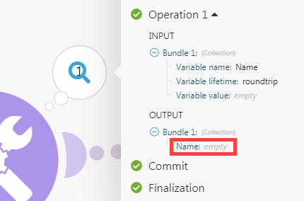

# Overzicht van module

Adobe Workfront Fusion onderscheidt vijf typen modules:

* Actiemodules
* Zoeken in modules
* Triggermodules
* Samenvoegapparatuur
* Iteratoren

Samenvoegapparatuur en iterators zijn geschikt voor geavanceerde scenario&#39;s.

## Actiemodules

Modules van de actie zijn het gemeenschappelijkste type van module. Een typische actiemodule voert een actie uit en keert één enkele bundel terug, die dan tot de volgende module voor verwerking overgaat.

In tegenstelling tot triggermodules kunnen actiemodules aan het begin, midden of einde van een scenario worden geplaatst.

Scenario&#39;s kunnen een onbeperkt aantal actiemodules bevatten, hoewel grote aantallen modules (150+) prestaties kunnen beïnvloeden.

>[!BEGINSHADEBOX]

**Voorbeelden:**

* **[!DNL Workfront]>[!UICONTROL Upload a file]** verzendt een bestand naar [!DNL Workfront] en retourneert de id ervan.
* **[!UICONTROL Image]>[!UICONTROL Resize]** ontvangt een afbeelding, past deze aan de opgegeven afmetingen aan en geeft de gewijzigde afbeelding door aan de volgende actie.

>[!ENDSHADEBOX]

Het type Handeling heeft vier subtypen:

* Maken
* Lezen
* Bijwerken
* Verwijderen

Het subtype Update bevat de volgende drie bewerkingen:

* **Wis de inhoud van een gebied**. Deze bewerking vindt plaats wanneer de inhoud van het veld wordt geëvalueerd naar het trefwoord `erase` (niet te verwarren met `empty` ).

  

* **verlaat de inhoud van een gebied onveranderd**. Deze bewerking vindt plaats wanneer het veld leeg blijft of wanneer de inhoud van het veld wordt geëvalueerd naar leeg (weergegeven als null in JSON).

  

* **vervangt de inhoud van een gebied**. Deze operatie vindt plaats in alle andere gevallen dan de twee hierboven beschreven gevallen.

>[!NOTE]
>
>* Als u het trefwoord `erase` niet ziet in het deelvenster Toewijzing, is de module geen updatemodule of is deze niet bijgewerkt naar de meest recente specificaties voor de app.
>* `Empty` wijzigt de inhoud van het veld niet. Als u het veld moet wissen, gebruikt u de volgende formule:
>
>   
>
>* Het ongewijzigd laten van een veld wanneer de inhoud ervan als leeg wordt beschouwd, wordt momenteel niet ondersteund.

## Zoeken in modules

De modules van het onderzoek keren nul, één, of meerdere bundels terug, die dan tot de volgende module voor verwerking overgaan.

U kunt de modules van het Onderzoek aan het begin, het midden, of het eind van een scenario plaatsen.

Scenario&#39;s kunnen een onbeperkt aantal modules van het Onderzoek bevatten, hoewel de grote aantallen modules (150+) prestaties kunnen beïnvloeden.

>[!BEGINSHADEBOX]

**Voorbeeld:**

**[!DNL Workfront]>[!UICONTROL Read Related Records]** leest records die overeenkomen met de zoekquery die u opgeeft, in een bepaald bovenliggend object.

>[!ENDSHADEBOX]

## Triggermodules

Triggers genereren bundels wanneer er een wijziging is opgetreden in een bepaalde service, zoals het maken of bijwerken van een record.

Triggers retourneren nul, een of meer bundels, die vervolgens worden doorgegeven aan de volgende module voor verwerking.

Omdat de Trekkers scenario&#39;s veroorzaken om met uitvoering te beginnen, kunnen zij slechts aan het begin van een scenario worden geplaatst.

Elk scenario kan slechts één trekker bevatten.

[!DNL Workfront Fusion] gebruikt twee typen triggers: opiniepeilingtriggers en Instant-triggers.

### Opiniepeilingtriggers

De opiniepeilingen brengen regelmatig opiniepeilingen een bepaalde dienst zelfs als er geen verandering sinds de vorige scenario looppas is geweest. Wij adviseren dat u een scenario plant dat een opiniepeilingtrekker bevat om met regelmatige intervallen te lopen. Als er een verandering is die de configuratie van de trekker aanpast, keert de trekker bundels terug die informatie over de verandering bevatten. Als er geen verandering is die de configuratie aanpast, voert de trekker geen bundels uit.

Voor instructies bij het plannen van een scenario, zie [ Plan een scenario ](/help/workfront-fusion/create-scenarios/config-scenarios-settings/schedule-a-scenario.md).

Met opiniepeilingtriggers kunt u de eerste bundel selecteren die wordt uitgevoerd via een deelvenster dat automatisch wordt weergegeven nadat u een trigger hebt opgeslagen of de triggerinstellingen hebt gewijzigd. Deze selectie heeft alleen invloed op de eerste uitvoering van de module. Nadat de module eenmaal is uitgevoerd, worden de volgende uitvoeringen alleen gecontroleerd op wijzigingen die zich na de meest recente uitvoering voordoen.

Voor meer informatie, zie [ kiezen waar een trekkermodule ](/help/workfront-fusion/create-scenarios/add-modules/choose-where-trigger-module-starts.md) begint.

>[!BEGINSHADEBOX]

**Voorbeelden:**

* **[!DNL Workfront]>[!UICONTROL Watch records]** retourneert records die pas zijn toegevoegd nadat het scenario voor het laatst is uitgevoerd.

* **[!DNL Google Sheets]>[!UICONTROL Watch Rows]** retourneert nieuwe rijen die zijn toegevoegd na de laatste keer dat het scenario werd uitgevoerd.

>[!ENDSHADEBOX]

### Instant triggers

Met instant-triggers kan een service [!DNL Workfront Fusion] direct na een wijziging op de hoogte stellen. Wij adviseren dat u een scenario plant dat een onmiddellijke trekker bevat om onmiddellijk te lopen.

Voor instructies, zie [ Plan een scenario ](/help/workfront-fusion/create-scenarios/config-scenarios-settings/schedule-a-scenario.md).

Voor details op hoe de inkomende gegevens door een onmiddellijke trekker worden behandeld, zie [ Onmiddellijke trekkers (webhooks) ](/help/workfront-fusion/references/modules/webhooks-reference.md).

>[!BEGINSHADEBOX]

**Voorbeelden:**

* **[!DNL Workfront]>[!UICONTROL Watch Events]** geeft informatie wanneer een bepaald type gebeurtenis in Workfront plaatsvindt, zoals het maken van een taak.
* **[!DNL Google Sheets]>[!UICONTROL Watch Changes]** geeft informatie wanneer een cel wordt bijgewerkt.

>[!ENDSHADEBOX]

## Samenvoegapparatuur

Een aggregatormodule accumuleert meerdere bundels tot één bundel.

De aggregators keren slechts één bundel terug, die dan tot de volgende module voor verdere verwerking overgaat.

U kunt aggregators slechts in het midden van een scenario plaatsen.

Scenario&#39;s kunnen een onbeperkt aantal aggregators bevatten, hoewel grote aantallen modules (150+) prestaties kunnen beïnvloeden.

>[!BEGINSHADEBOX]

**Voorbeelden:**

* **[!UICONTROL Archive]>[!UICONTROL Create an archive]** comprimeert meerdere bestanden tot een ZIP-archief.
* **[!UICONTROL CSV]>[!UICONTROL Aggregate to CSV]** voegt meerdere tekenreeksen van een CSV-bestand samen tot één rij.
* **[!UICONTROL Tools]>[!UICONTROL Text aggregator]** combineert meerdere tekenreeksen tot één tekenreeks.

>[!ENDSHADEBOX]

Voor meer informatie, zie [ de module van de Samenvoegaar ](/help/workfront-fusion/references/modules/aggregator-module.md).

## Iteratoren

Een iterator is een type module dat arrays splitst in afzonderlijke bundels.

Iterators retourneren een of meer bundels, die vervolgens worden doorgegeven aan de volgende module voor verwerking.

U kunt Iterators slechts in het midden van een scenario plaatsen.

Scenario&#39;s kunnen een onbeperkt aantal iterators bevatten, hoewel grote aantallen modules (150+) prestaties kunnen beïnvloeden.

>[!BEGINSHADEBOX]

**Voorbeeld:**

**[!UICONTROL Email]>[!UICONTROL Retrieve attachments]** breekt een array met bijlagen in afzonderlijke bundels.

>[!ENDSHADEBOX]

Voor meer informatie, zie [&#128279;](/help/workfront-fusion/references/modules/iterator-module.md) de module van de Teller 0&rbrace; en [ Kaart een serie ](/help/workfront-fusion/create-scenarios/map-data/map-an-array.md).
