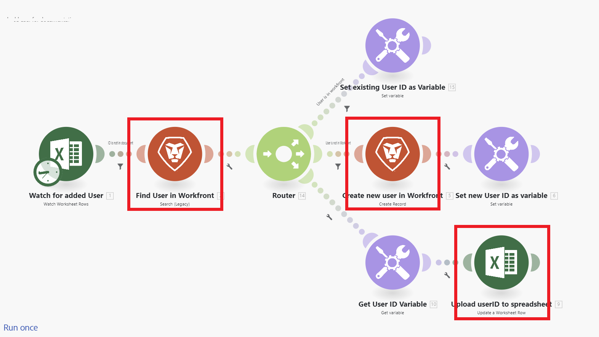

# Overzicht van scenario

De rol van Adobe Workfront Fusion is om uw processen te automatiseren zodat uw gebruikers niet zo veel tijd aan routinetaken hoeven door te brengen. Het werkt door acties binnen en tussen apps en de diensten te verbinden om een scenario tot stand te brengen dat uw gegevens automatisch overbrengt en transformeert. Het scenario dat u voor gegevens in een app of service maakt, verwerkt die gegevens om het gewenste resultaat te verkrijgen.

Een scenario bestaat uit een reeks modules die aangeven hoe gegevens binnen een app moeten worden getransformeerd of moeten worden overgebracht tussen apps en webservices.

## Overzicht van Scenario-elementen

Een scenario is gebouwd van verschillende elementen. Door de terminologie van deze elementen te begrijpen, is het gemakkelijker om de documentatie te gebruiken.

* [Scenario](#scenario)
* [Trigger](#trigger)
* [Module](#module)
* [Route](#route)
* [Scenario-segment](#scenario-segment)
* [Connector](#connector)

### Scenario

A **scenario** is een user-created reeks geautomatiseerde stappen, die worden gecreeerd om gegevens te bewegen en te manipuleren. De term &quot;scenario&quot; verwijst naar de gehele groep van verbonden stappen.

### Trigger

Een scenario begint met a **trekker**. De trekkerstalen voor nieuwe en bijgewerkte gegevens, en beginnen het scenario wanneer bepaalde die voorwaarden in de module worden gevormd van toepassing zijn. Triggers kunnen worden gevormd om een scenario op een programma (opiniepeiling) te beginnen, of wanneer de gegevensveranderingen (onmiddellijk) voorkomen.

### Module

De trekker wordt gevolgd door een aantal **modules**. Een module vertegenwoordigt één enkele stap in een scenario dat een specifieke actie uitvoert. De modules worden gevormd en samen geketend om scenario&#39;s tot stand te brengen.

### Route

Een scenario kan in **routes** worden verdeeld. Een route is een sectie van het scenario dat voor een bepaalde bundel van gegevens kan of niet kan worden gebruikt. Routes worden opstelling gebruikend een routermodule en filters.

### Scenario-segment

Een scenario segment is een sectie van een scenario dat uit een reeks aangrenzende modules bestaat die allen met de zelfde toepassing verbinden. Scenario-segmenten vertegenwoordigen vaak een korte workflow in de toepassing.

### Connector

Een schakelaar is de reeks modules voor een bepaalde toepassing. Workfront Fusion biedt connectors aan voor veel gangbare werktoepassingen, zoals Workfront, Salesforce en Jira, en generieke connectors die voor elke webservice kunnen worden gebruikt.

## Voorbeelden

Vouw de volgende secties uit om voorbeeldscenario&#39;s en de bijbehorende uitleg weer te geven.

+++**het Automatiseren processen binnen Adobe Workfront**

Met Workfront Fusion kunt u eenvoudige of complexe workflows in Workfront automatiseren, waardoor u tijd bespaart en ervoor zorgt dat het proces consistent wordt uitgevoerd.

In dit voorbeeld wordt het scenario geactiveerd wanneer een opgegeven veld in een taak of probleem in Workfront verandert. Wanneer teweeggebracht, krijgt het scenario informatie in het verwante project en leidt tot een op maat gemaakte update voor een persoon die aan een specifieke rol op het project wordt toegewezen.

+++

+++**Verbindend Workfront met een andere app of Webdienst**

>[!NOTE]
>
>Als uw organisatie het oudere licentiemodel gebruikt, moet uw organisatie een Workfront Fusion for Work Automation and Integration-licentie hebben om verbinding te kunnen maken met andere toepassingen.

Workfront Fusion kan verbinding maken met andere toepassingen en webservices. U kunt gegevens uit andere toepassingen openen, importeren, bewerken of exporteren, en deze integreren met Workfront of met elkaar.

Veel toepassingen hebben speciale Workfront Fusion-connectors. Als er geen specifieke connector is voor de toepassing waartoe u toegang wilt hebben, kunt u de HTTP- of SOAP-modules van Workfront Fusion gebruiken om verbinding te maken met de toepassing via de API.

In dit voorbeeld wordt het scenario geactiveerd wanneer een gebruiker aan een [!DNL Excel] -spreadsheet wordt toegevoegd. Het scenario controleert of de gebruiker in Workfront is. Als dat niet het geval is, wordt de gebruiker in Workfront gemaakt en wordt de Workfront-gebruikersnaam weer aan het werkblad toegevoegd.

Voor een lijst van specifieke schakelaars, zie [ toepassingen van de Fusie en hun moduleverwijzingen: artikelindex ](/help/workfront-fusion/references/apps-and-modules/apps-and-modules-toc.md).

>[!IMPORTANT]
>
>Adobe Workfront Fusion kan verbinding maken met vrijwel elke webservice. Als de app waarmee u wilt werken geen speciale Workfront Fusion-connector heeft, kunt u universele connectors gebruiken om verbinding te maken met de app of service.
>
>Voor een lijst van universele schakelaars, zie [ Universele schakelaars ](/help/workfront-fusion/references/apps-and-modules/apps-and-modules-toc.md#universal-connectors)

+++

## Verwijzingen

* Voor een verklarende woordenlijst van termijnen die in de Fusie van Workfront worden gebruikt, zie [ verklarende woordenlijst van de Fusie van Adobe Workfront ](/help/workfront-fusion/get-started-with-fusion/understand-fusion/fusion-glossary.md).
* Beginnen bouwend een praktijkscenario, zie [ een basisscenario ](/help/workfront-fusion/build-practice-scenarios/create-basic-scenario.md) creëren.
* Raadpleeg de volgende artikelen voor informatie over het maken en beheren van scenario&#39;s:
   * [Scènes maken](/help/workfront-fusion/create-scenarios/create-scenarios-toc.md)
   * [scenario&#39;s beheren](/help/workfront-fusion/manage-scenarios/manage-scenarios-toc.md)
