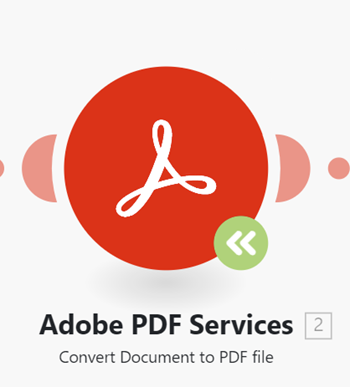

# Een module upgraden naar een nieuwe versie

Omdat de toepassingen waarmee Workfront Fusion verbinding maakt nieuwe versies kunnen bijwerken of vrijgeven, is het soms nodig dat Fusion bijgewerkte modules voor die toepassingen vrijgeeft.

Als u een groen pictogram van de module van de Verbetering op een module in een scenario ziet, heeft Workfront Fusion een nieuwe versie van die module vrijgegeven.

U kunt de module bijwerken zonder een nieuw scenario te maken.

## Toegangsvereisten

+++ Breid uit om de toegangseisen voor de functionaliteit in dit artikel weer te geven.

<table style="table-layout:auto">
 <col> 
 <col> 
 <tbody> 
  <tr> 
   <td role="rowheader">Adobe Workfront-pakket</td> 
   <td> 
Elk Adobe Workfront Workflow-pakket en elk Adobe Workfront Automation and Integration-pakket

Workfront Ultimate

Workfront Prime en Select packages, met extra aanschaf van Workfront Fusion.
 </td> 
  </tr> 
  <tr data-mc-conditions=""> 
   <td role="rowheader">Adobe Workfront-licenties</td> 
   <td> 
Standard

Werk of hoger
 </td> 
  </tr> 
  <tr> 
   <td role="rowheader">Product</td> 
   <td>
   
Als uw organisatie een Select- of Prime Workfront-pakket heeft dat geen Workfront Automation and Integration bevat, moet uw organisatie Adobe Workfront Fusion aanschaffen.</li></ul>
   </td> 
  </tr>
 </tbody> 
</table>

Voor meer detail over de informatie in deze lijst, zie [ vereisten van de Toegang in documentatie ](/help/workfront-fusion/references/licenses-and-roles/access-level-requirements-in-documentation.md).

+++

## Een Workfront-module upgraden naar een nieuwe versie

1. Klik het **pictogram van de 1} pictogram van de module van de Verbetering** 
   
1. Kies een van de volgende opties:

   * Om een nieuwe module te selecteren om deze module (in plaats van de bevordering van de module) te vervangen, klik **kies nieuw**, dan te werk zoals die in [ wordt beschreven een niet-Workfront module aan een nieuwe versie ](#upgrade-a-non-workfront-module-to-a-new-version) bevordert.
   * Om slechts deze module te bevorderen, die moduleconfiguratie bewaren, klik **Verbetering**.
   * Om alle modules van Workfront in het scenario te bevorderen, klik **Verbetering allen**.

1. Sla het scenario op.

>[!NOTE]
>
>Als u de modules van Workfront hebt bevorderd, adviseren wij hen te openen en de moduleconfiguratie te controleren.

## Een niet-Workfront-module upgraden naar een nieuwe versie

1. Klik het **pictogram van de 1} pictogram van de module van de Verbetering** 
   
1. Klik **kiezen nieuw**.
1. Selecteer de module die u de vorige module wilt vervangen.
1. Vorm de module met de zelfde montages zoals de bestaande module.
1. Verbind de nieuwe module met het scenario op de zelfde plaats zoals de bestaande module.
1. Verwijder de oude module.
1. Sla het scenario op.
