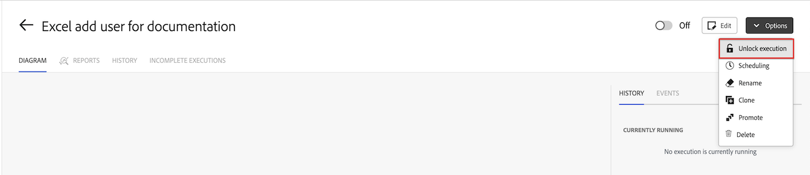

# Vergrendelde scenario&#39;s beheren

In sommige gevallen kan een scenario tijdelijk zijn vergrendeld in [!DNL Workfront Fusion] . Vergrendelde scenario&#39;s worden binnen 2-4 uur automatisch ontgrendeld. U kunt scenario&#39;s manueel ontgrendelen, maar het wordt over het algemeen niet geadviseerd.

Scenario&#39;s kunnen om een aantal redenen worden vergrendeld:

* Workfront Fusion ondersteunt geen parallelle verwerking van geplande scenario&#39;s. Deze scenario&#39;s worden gesloten aan het begin van de scenariouitvoering en ontgrendeld wanneer het voltooit. Als de uitvoering wordt onderbroken, kan het scenario niet ontgrendelen. Dit kan voorkomen wanneer een gebruiker manueel dwingen-houdt het scenario, of wanneer er een systeemkwestie is.

* Het technische team van Workfront Fusion kan een scenario vergrendelen omdat dit prestaties of andere problemen veroorzaakt.

## Toegangsvereisten

+++ Breid uit om de toegangseisen voor de functionaliteit in dit artikel weer te geven.

U moet de volgende toegang hebben om de functionaliteit in dit artikel te kunnen gebruiken:

<table style="table-layout:auto">
 <col> 
 <col> 
 <tbody> 
  <tr> 
   <td role="rowheader">[!DNL Adobe Workfront] package</td> 
   <td> 
Alle
 </td> 
  </tr> 
  <tr data-mc-conditions=""> 
   <td role="rowheader">[!DNL Adobe Workfront] licentie</td> 
   <td> 
Nieuw: [!UICONTROL Standard]

of

Huidig: [!UICONTROL Work] of hoger
 </td> 
  </tr> 
  <tr> 
   <td role="rowheader">[!DNL Adobe Workfront Fusion] licentie**</td> 
   <td>
   
Huidig: Geen [!DNL Workfront Fusion] vereiste licentie.

   
of

   
Verouderd: alle 

   </td> 
  </tr> 
  <tr> 
   <td role="rowheader">Product</td> 
   <td>
   
Nieuw:
 <ul><li>[!UICONTROL Select] of [!UICONTROL Prime] [!DNL Workfront] -abonnement: uw organisatie moet het abonnement aanschaffen [!DNL Adobe Workfront Fusion] .</li><li>[!UICONTROL Ultimate] [!DNL Workfront] abonnement: [!DNL Workfront Fusion] is opgenomen.</li></ul>
   
of

   
Huidig: Uw organisatie moet [!DNL Adobe Workfront Fusion] aanschaffen.

   </td> 
  </tr>
  <tr data-mc-conditions=""> 
   <td role="rowheader">Configuraties op toegangsniveau*</td> 
   <td> 
     
U moet een [!DNL Workfront Fusion] beheerder voor uw organisatie zijn.

     
U moet een [!DNL Workfront Fusion] beheerder voor uw team zijn.

   </td> 
  </tr> 
   </td> 
  </tr> 
 </tbody> 
</table>

Voor meer detail over de informatie in deze lijst, zie [ vereisten van de Toegang in documentatie ](/help/workfront-fusion/references/licenses-and-roles/access-level-requirements-in-documentation.md).

Voor informatie over [!DNL Adobe Workfront Fusion] vergunningen, zie [[!DNL Adobe Workfront Fusion]  vergunningen ](/help/workfront-fusion/set-up-and-manage-workfront-fusion/licensing-operations-overview/license-automation-vs-integration.md).

+++

## Een vergrendeld scenario ontgrendelen

Vergrendelde scenario&#39;s ontgrendelen 2 tot 4 uur vanaf het moment dat ze vergrendeld waren. U kunt een scenario manueel ontgrendelen alvorens het wordt gepland om automatisch te ontgrendelen.

>[!WARNING]
>
>Het ontgrendelen van een scenario kan fouten in de uitvoeringen van een scenario manueel veroorzaken. Wij adviseren manueel ontgrendelende scenario&#39;s slechts wanneer een scenario wegens het lopen en het tegenhouden van uitvoeringen als deel van het ontwerpen van het scenario wordt gesloten. In andere omstandigheden, adviseren wij dat u op het scenario wacht automatisch worden ontgrendeld.

Een vergrendeld scenario handmatig ontgrendelen:

1. Ga de de detailpagina van het Scenario van het gesloten scenario.
1. Klik op **[!UICONTROL Options]** in de rechterbovenhoek van het scherm.
1. Selecteer **[!UICONTROL Unlock execution]** .
1. Klik op **[!UICONTROL Unlock]**.
   
