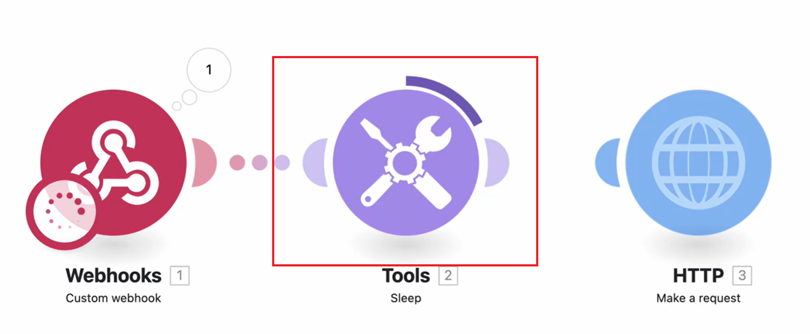

# De gegevensstroom van de mening in een lopend scenario

U kunt op een lopend scenario letten om te zien hoe de gegevens door het stromen.

Terwijl een scenario loopt, wordt de actieve module duidelijk door een groeiende ring rond de module. De ring toont slechts dat de module loopt, niet zijn vooruitgang. De modules die snel lopen kunnen slechts een klein deel van de ring tonen.

Nadat de module is uitgevoerd, wordt een uitvoerindicator weergegeven.

Als de module meer dan één bumdle verwerkt, verschijnt de ring voor elke verwerkte bundel, en de outputindicator telt omhoog voor elke bundel het output.

Voor meer informatie over de stroom van scenario- gegevens, zie [ de uitvoeringsstroom van het scenario ](/help/workfront-fusion/references/scenarios/scenario-execution-flow.md).

## Toegangsvereisten

+++ Breid uit om de toegangseisen voor de functionaliteit in dit artikel weer te geven.

U moet de volgende toegang hebben om de functionaliteit in dit artikel te kunnen gebruiken:

<table style="table-layout:auto">
 <col> 
 <col> 
 <tbody> 
  <tr> 
   <td role="rowheader">[!DNL Adobe Workfront] package</td> 
   <td> 
Alle
 </td> 
  </tr> 
  <tr data-mc-conditions=""> 
   <td role="rowheader">[!DNL Adobe Workfront] licentie</td> 
   <td> 
Nieuw: [!UICONTROL Standard]

of

Huidig: [!UICONTROL Work] of hoger
 </td> 
  </tr> 
  <tr> 
   <td role="rowheader">[!DNL Adobe Workfront Fusion] licentie**</td> 
   <td>
   
Huidig: Geen [!DNL Workfront Fusion] vereiste licentie.

   
of

   
Verouderd: alle 

   </td> 
  </tr> 
  <tr> 
   <td role="rowheader">Product</td> 
   <td>
   
Nieuw:
 <ul><li>[!UICONTROL Select] of [!UICONTROL Prime] [!DNL Workfront] -abonnement: uw organisatie moet het abonnement aanschaffen [!DNL Adobe Workfront Fusion] .</li><li>[!UICONTROL Ultimate] [!DNL Workfront] abonnement: [!DNL Workfront Fusion] is opgenomen.</li></ul>
   
of

   
Huidig: Uw organisatie moet [!DNL Adobe Workfront Fusion] aanschaffen.

   </td> 
  </tr>
  <tr data-mc-conditions=""> 
   <td role="rowheader">Configuraties op toegangsniveau*</td> 
   <td> 
     
U moet een [!DNL Workfront Fusion] beheerder voor uw organisatie zijn.

     
U moet een [!DNL Workfront Fusion] beheerder voor uw team zijn.

   </td> 
  </tr> 
   </td> 
  </tr> 
 </tbody> 
</table>

Voor meer detail over de informatie in deze lijst, zie [ vereisten van de Toegang in documentatie ](/help/workfront-fusion/references/licenses-and-roles/access-level-requirements-in-documentation.md).

Voor informatie over [!DNL Adobe Workfront Fusion] vergunningen, zie [[!DNL Adobe Workfront Fusion]  vergunningen ](/help/workfront-fusion/set-up-and-manage-workfront-fusion/licensing-operations-overview/license-automation-vs-integration.md).

+++

## De gegevensstroom van de mening in een lopend scenario

1. Klik op de tab **[!UICONTROL Scenarios]** in het linkerdeelvenster.
1. Selecteer het scenario waarin u de gegevensstroom wilt weergeven.
1. Als het scenario niet loopt, activeer het of klik **in werking stellen eens** om de scenariouitvoering te beginnen.
1. Selecteer de uitvoering die u wilt weergeven in het gedeelte Momenteel wordt uitgevoerd van het deelvenster Historie van uitvoering.

