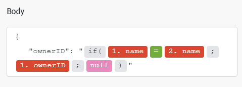

# [!DNL Azure Active Directory] modules

In een Adobe Workfront Fusion-scenario kunt u workflows automatiseren die [!DNL Azure Active Directory] gebruiken en deze koppelen aan meerdere toepassingen en services van derden.

Voor instructies bij het creëren van een scenario, zie de artikelen onder [&#x200B; scenario&#39;s creëren: artikelindex &#x200B;](/help/workfront-fusion/create-scenarios/create-scenarios-toc.md).

Voor informatie over modules, zie de artikelen onder [&#x200B; Modules: artikelindex &#x200B;](/help/workfront-fusion/references/modules/modules-toc.md).

## Toegangsvereisten

+++ Breid uit om de toegangseisen voor de functionaliteit in dit artikel weer te geven.

U moet de volgende toegang hebben om de functionaliteit in dit artikel te kunnen gebruiken:

<table style="table-layout:auto">
 <col> 
 <col> 
 <tbody> 
  <tr> 
   <td role="rowheader">Adobe Workfront-pakket</td> 
   <td> 
Alle
 </td> 
  </tr> 
  <tr data-mc-conditions=""> 
   <td role="rowheader">Adobe Workfront-licentie</td> 
   <td> 
Nieuw: Standaard

of

Huidig: Werk of hoger
 </td> 
  </tr> 
  <tr> 
   <td role="rowheader">Adobe Workfront Fusion-licentie**</td> 
   <td>
   
Huidig: Geen Workfront Fusion-licentievereisten

   
of

   
Verouderd: Workfront Fusion for Work Automation and Integration 

   </td> 
  </tr> 
  <tr> 
   <td role="rowheader">Product</td> 
   <td>
   
Nieuw:
 <ul><li>Select- of Prime Workfront-pakket: uw organisatie moet Adobe Workfront Fusion aanschaffen.</li><li>Ultimate Workfront-pakket: Workfront Fusion is inbegrepen.</li></ul>
   
of

   
Huidig: Uw organisatie moet Adobe Workfront Fusion aanschaffen.

   </td> 
  </tr>
 </tbody> 
</table>

Voor meer detail over de informatie in deze lijst, zie [&#x200B; vereisten van de Toegang in documentatie &#x200B;](/help/workfront-fusion/references/licenses-and-roles/access-level-requirements-in-documentation.md).

Voor informatie over de vergunningen van de Fusie van Adobe Workfront, zie [&#x200B; de Fusie van Adobe Workfront vergunningen &#x200B;](/help/workfront-fusion/set-up-and-manage-workfront-fusion/licensing-operations-overview/license-automation-vs-integration.md).

+++

## Vereisten

Als u [!DNL Azure Active Directory] -modules wilt gebruiken, hebt u een [!DNL Azure Active Directory] -account nodig.

## [!DNL Azure Active Directory] API-informatie

De Azure Actieve schakelaar van de Folder gebruikt het volgende:

<table style="table-layout:auto"> 
 <col> 
 <col> 
 <tbody> 
  <tr> 
   <td role="rowheader">API-versie</td> 
   <td> v1.0 </td> 
  </tr> 
  <tr> 
   <td role="rowheader">API-tag</td> 
   <td>v1.4.5</td> 
  </tr>
 </tbody> 
</table>

## [!DNL Azure Active Directory] modules en hun velden

Wanneer u [!DNL Azure Active Directory] modules configureert, geeft Workfront Fusion de onderstaande velden weer. Daarnaast kunnen aanvullende [!DNL Azure Active Directory] -velden worden weergegeven, afhankelijk van factoren zoals uw toegangsniveau in de app of service. Een bolde titel in een module wijst op een vereist gebied.

Als u de kaartknoop boven een gebied of een functie ziet, kunt u het gebruiken om variabelen en functies voor dat gebied te plaatsen. Voor meer informatie, zie [&#x200B; informatie van de Kaart van één module aan een andere in de Fusie van Adobe Workfront &#x200B;](/help/workfront-fusion/create-scenarios/map-data/map-data-from-one-to-another.md).

* [Triggers](#triggers)
* [Handelingen](#actions)
* [Zoekopdrachten](#searches)

### Triggers

#### [!UICONTROL Watch records] (gepland)

Deze (geplande) triggermodule voert een scenario uit wanneer een record in een geselecteerd object is gemaakt sinds de laatste geplande run in [!DNL Azure Active Directory] . Het keert ook alle standaardgebieden verbonden aan het verslag of de verslagen, samen met om het even welke douanegebieden en waarden terug die de verbinding toegang heeft.U kunt deze informatie in verdere modules in het scenario in kaart brengen.

Als u deze module configureert, worden de volgende velden weergegeven.

<table style="table-layout:auto"> 
 <col> 
 <col> 
 <tbody> 
  <tr> 
   <td role="rowheader">[!UICONTROL Connection]</td> 
   <td> 
Voor instructies over het aansluiten van uw [!DNL Azure Active Directory] rekening aan de Fusie van Workfront, zie <a href="/help/workfront-fusion/create-scenarios/connect-to-apps/connect-to-fusion-general.md" class="MCXref xref" data-mc-variable-override=""> een verbinding aan de Fusie van Adobe Workfront tot stand brengen - Basisinstructies </a>.
 </td> 
  </tr> 
  <tr> 
   <td role="rowheader">[!UICONTROL Type]</td> 
   <td>Selecteer of u gebruikersrecords of groepsrecords wilt bekijken.</td> 
  </tr> 
  <tr> 
   <td role="rowheader">[!UICONTROL Maximum Number of Records]</td> 
   <td>Ga of kaart het maximumaantal verslagen in u de module tijdens elke cyclus van de scenariouitvoering wilt terugkeren.</td> 
  </tr> 
 </tbody> 
</table>

### Handelingen

* [[!UICONTROL Read Record]](#read-record)
* [[!UICONTROL Create Record]](#create-record)
* [[!UICONTROL Custom API Call]](#custom-api-call)

#### [!UICONTROL Read Record]

Deze actiemodule leest gegevens uit één record in [!DNL Azure Active Directory] .

U geeft de id van de record op.

De module retourneert de id van de record en de bijbehorende velden, samen met aangepaste velden en waarden die door de verbinding worden geopend. U kunt deze informatie in verdere modules in het scenario in kaart brengen.

U moet over voldoende machtigingen beschikken om toegang te krijgen tot de record in [!DNL Azure Active Directory] om deze gegevens op te halen.

Als u deze module configureert, worden de volgende velden weergegeven.

<table style="table-layout:auto">
 <col> 
 <col> 
 <tbody> 
  <tr> 
   <td role="rowheader">[!UICONTROL Connection]</td> 
   <td> 
Voor instructies over het aansluiten van uw [!DNL Azure Active Directory] rekening aan de Fusie van Workfront, zie <a href="/help/workfront-fusion/create-scenarios/connect-to-apps/connect-to-fusion-general.md" class="MCXref xref" data-mc-variable-override=""> een verbinding aan de Fusie van Adobe Workfront tot stand brengen - Basisinstructies </a>.
 </td> 
  </tr> 
  <tr> 
   <td role="rowheader">[!UICONTROL Record Type]</td> 
   <td>Selecteer of u een [!UICONTROL User] -record of een [!UICONTROL Group] -record wilt lezen.</td> 
  </tr> 
  <tr> 
   <td role="rowheader">[!UICONTROL Outputs]</td> 
   <td>Selecteer de informatie die u in de uitvoerbundel voor deze module wilt opnemen.</td> 
  </tr> 
  <tr> 
   <td role="rowheader">[!UICONTROL ID]</td> 
   <td>Voer de unieke [!DNL Azure Active Directory] -id in of wijs deze toe aan de record die u wilt lezen in de module.</td> 
  </tr> 
 </tbody> 
</table>

#### [!UICONTROL Create Record]

Deze actiemodule maakt een nieuwe gebruiker- of groepsrecord.

U geeft het gewenste type record op.

De module retourneert de id van de record en de bijbehorende velden, samen met aangepaste velden en waarden die door de verbinding worden geopend. U kunt deze informatie in verdere modules in het scenario in kaart brengen.

Als u deze module configureert, worden de volgende velden weergegeven.

<table style="table-layout:auto">
 <col> 
 <col> 
 <tbody> 
  <tr> 
   <td role="rowheader">[!UICONTROL Connection]</td> 
   <td> 
Voor instructies over het aansluiten van uw [!DNL Azure Active Directory] rekening aan de Fusie van Workfront, zie <a href="/help/workfront-fusion/create-scenarios/connect-to-apps/connect-to-fusion-general.md" class="MCXref xref" data-mc-variable-override=""> een verbinding aan de Fusie van Adobe Workfront tot stand brengen - Basisinstructies </a>.
 </td> 
  </tr> 
  <tr> 
   <td role="rowheader">[!UICONTROL Record Type]</td> 
   <td>Selecteer of u een [!UICONTROL User] -record of een [!UICONTROL Group] -record wilt lezen.</td> 
  </tr> 
  <tr> 
   <td role="rowheader">[!UICONTROL Other Fields]</td> 
   <td>Vul deze velden in om de waarden voor de nieuwe record in te stellen.</td> 
  </tr> 
 </tbody> 
</table>

#### [!UICONTROL Custom API Call]

Met deze actiemodule kunt u een aangepaste, geverifieerde aanroep van de [!DNL Azure Active Directory] API maken. Op deze manier kunt u een automatisering van de gegevensstroom maken die niet door de andere [!DNL Azure Active Directory] -modules kan worden uitgevoerd.

Als u deze module configureert, worden de volgende velden weergegeven.

<table style="table-layout:auto">
 <col> 
 <col> 
 <tbody> 
  <tr> 
   <td role="rowheader">[!UICONTROL Connection]</td> 
   <td> 
Voor instructies over het aansluiten van uw [!DNL Azure Active Directory] rekening aan de Fusie van Workfront, zie <a href="/help/workfront-fusion/create-scenarios/connect-to-apps/connect-to-fusion-general.md" class="MCXref xref" data-mc-variable-override=""> een verbinding aan de Fusie van Adobe Workfront tot stand brengen - Basisinstructies </a>.
 </td> 
  </tr> 
  <tr> 
   <td role="rowheader">[!UICONTROL URL]</td> 
   <td>Een pad invoeren of toewijzen ten opzichte van <code>https://graph.microsoft.com/{version}/{resource}?{query-parameters}</code></td> 
  </tr> 
  <tr> 
   <td role="rowheader">[!UICONTROL Method]</td> 
   <td> 
Selecteer de HTTP- verzoekmethode u de API vraag moet vormen. Voor meer informatie, zie <a href="/help/workfront-fusion/references/modules/http-request-methods.md" class="MCXref xref" data-mc-variable-override=""> HTTP- verzoekmethodes </a>.
 </td> 
  </tr> 
  <tr> 
   <td role="rowheader">[!UICONTROL Headers]</td> 
   <td> 
Voeg de kopteksten van het verzoek toe in de vorm van een standaard JSON-object.
 
Bijvoorbeeld: <code>{"Content-type":"application/json"}</code>
 </td> 
  </tr> 
  <tr> 
   <td role="rowheader">[!UICONTROL Query String]</td> 
   <td> 
Voeg de query voor de API-aanroep toe als een standaard JSON-object.
 
Bijvoorbeeld: <code>{"name":"something-urgent"}</code>
 </td> 
  </tr> 
  <tr> 
   <td role="rowheader">[!UICONTROL Body]</td> 
   <td> 
Voeg de inhoud van de hoofdtekst voor de API-aanroep toe in de vorm van een standaard JSON-object.
 
Opmerking:  
Wanneer u voorwaardelijke instructies gebruikt, zoals <code>if</code> in uw JSON, plaatst u de aanhalingstekens buiten de voorwaardelijke instructie.
 
     
Example: </b>"> 
      
  
 
     
 
 </td> 
  </tr> 
 </tbody> 
</table>

### Zoekopdrachten

* [Gebruikers zoeken](#search-users)
* [Delta voor gebruikers/groepen doorzoeken](#search-usersgroups-delta)

#### [!UICONTROL Search Users]

Deze zoekmodule zoekt naar records in een object in [!DNL Azure Active Directory] dat overeenkomt met de zoekquery die u opgeeft. U kunt deze informatie in verdere modules in het scenario in kaart brengen.

Als u deze module configureert, worden de volgende velden weergegeven.

<table style="table-layout:auto">
 <col> 
 <col> 
 <tbody> 
  <tr> 
   <td role="rowheader">[!UICONTROL Connection]</td> 
   <td> 
Voor instructies over het aansluiten van uw [!DNL Azure Active Directory] rekening aan de Fusie van Workfront, zie <a href="/help/workfront-fusion/create-scenarios/connect-to-apps/connect-to-fusion-general.md" class="MCXref xref" data-mc-variable-override=""> een verbinding aan de Fusie van Adobe Workfront tot stand brengen - Basisinstructies </a>.
 </td> 
  </tr> 
  <tr data-mc-conditions=""> 
   <td role="rowheader">[!UICONTROL Search Criteria]</td> 
   <td> 
Voer de criteria in die u in de zoekopdracht wilt gebruiken.
 
Voor informatie over de te gebruiken parameters, zoals "[!UICONTROL $filter]", zie <a href="https://docs.microsoft.com/en-us/graph/query-parameters"> de vraagparameters van het Gebruik om reacties </a> in de [!DNL Microsoft] API documentatie aan te passen.
 </td> 
  </tr> 
  <tr data-mc-conditions=""> 
   <td role="rowheader">[!UICONTROL Outputs]</td> 
   <td>Selecteer de informatie die u in de uitvoerbundel voor deze module wilt opnemen.</td> 
  </tr> 
  <tr data-mc-conditions=""> 
   <td role="rowheader">[!UICONTROL Maximal count of records]</td> 
   <td>Ga of kaart het maximumaantal verslagen in u de module tijdens elke cyclus van de scenariouitvoering wilt terugkeren.</td> 
  </tr> 
 </tbody> 
</table>

#### [!UICONTROL Search Users/Groups Delta]

Deze zoekmodule zoekt naar records in [!DNL Azure AD] die zijn gemaakt, bijgewerkt of verwijderd. U kunt deze informatie in verdere modules in het scenario in kaart brengen.

<table style="table-layout:auto">
 <col> 
 <col> 
 <tbody> 
  <tr> 
   <td role="rowheader">[!UICONTROL Connection]</td> 
   <td> 
Voor instructies over het aansluiten van uw [!DNL Azure Active Directory] rekening aan de Fusie van Workfront, zie <a href="/help/workfront-fusion/create-scenarios/connect-to-apps/connect-to-fusion-general.md" class="MCXref xref" data-mc-variable-override=""> een verbinding aan de Fusie van Adobe Workfront tot stand brengen - Basisinstructies </a>.
 </td> 
  </tr> 
  <tr data-mc-conditions=""> 
   <td role="rowheader">[!UICONTROL Limit]</td> 
   <td>Ga of kaart het maximumaantal verslagen in u de module tijdens elke cyclus van de scenariouitvoering wilt terugkeren.</td> 
  </tr> 
 </tbody> 
</table>
