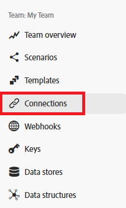

# Verbindingsmetagegevens

Fusion gebruikt metagegevens om belangrijke kenmerken van een verbinding te identificeren.

Verbindingsmetagegevens kunnen worden ingesteld wanneer u een nieuwe verbinding maakt. Deze kenmerken bevinden zich in hetzelfde dialoogvenster dat wordt gebruikt voor het instellen van een verbinding:

Fusiegebruikers kunnen verbindingen weergeven en bewerken vanuit het gebied Verbindingen. U kunt het gebied van Verbindingen bereiken door Verbindingen in de linkernavigatie te klikken.

<!---->

## Omgevingstype

Fusieverbindingen kunnen zowel door productie- als niet-productiesystemen worden gebruikt. U kunt het type omgeving markeren waarmee een verbinding verbinding maakt, wat productieomgevingen helpt te beschermen.

Het omgevingstype wordt, net als andere verbindingsmetagegevens, alleen ter informatie gebruikt. De gebruikers zijn verantwoordelijk voor het nauwkeurig plaatsen van dit attribuut, en het gebruiken van een verbinding met het correcte milieu in een scenario.

## Type verificatie

De verbindingen van de fusie kunnen voor zowel de dienstrekeningen als persoonlijke rekeningen worden gebruikt. De rekeningen van de dienst worden gebruikt voor authentificatie wanneer een scenario als Fusie automatiseert. Persoonlijke accounts zijn op een specifieke persoon gebaseerde verificatie. Welk authentificatietype wordt gebruikt hangt van de vereisten van het scenario af. Persoonlijke accounts moeten worden gebruikt voor geautomatiseerde gebruikersacties. Bijvoorbeeld, als een scenario van de Fusie goedkeuring door een specifieke persoon automatiseert, dan zou het authentificatietype voor die persoon moeten zijn. Anders fungeert Fusion als Fusion en zou het type Servicerekening moeten zijn.

Het verificatietype wordt, net als andere verbindingsmetagegevens, alleen ter informatie gebruikt. De gebruikers zijn verantwoordelijk voor nauwkeurig het plaatsen van dit attribuut, en het gebruiken van het correcte type van verbinding in een scenario.

Voor meer informatie over authentificatietypen, te zien gelieve [ Authentificatie ](https://developer.adobe.com/developer-console/docs/guides/authentication/) in de gids van de Authentificatie van Adobe.

## Bronnen

* Voor instructies bij het beheren van verbindingsmeta-gegevens, zie [ verbindingen ](/help/workfront-fusion/create-scenarios/connect-to-apps/manage-connections.md) beheren.
