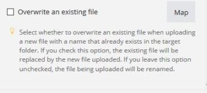

# Gegevenstypen item

U kunt de hieronder vermelde objecttypen in een bundel opnemen.

Voor informatie over welke types van punten de Fusie van Workfront voor omzetting tussen elkaar toestaat, zie [&#x200B; Druk van het Type &#x200B;](/help/workfront-fusion/references/mapping-panel/data-types/type-coercion.md).

<table style="table-layout:auto">
 <col> 
 <col> 
 <tbody> 
  <tr> 
   <td role="rowheader"> 
Tekst
 </td> 
   <td> 
Het meest gangbare itemtype. Voor sommige tekstitems controleert Adobe Workfront Fusion of aan de maximum- of minimumlengte is voldaan of de indeling van het item is gevalideerd (e-mail, URL of bestandsnaam).
 </td> 
  </tr> 
  <tr> 
   <td role="rowheader"> 
Getal
 </td> 
   <td> 
Voor sommige numerieke items kan Workfront Fusion de invoer voor een opgegeven bereik (de minimaal of maximaal toegestane waarde) valideren.
 </td> 
  </tr> 
  <tr> 
   <td role="rowheader"> 
Boolean (Ja/Nee)
 </td> 
   <td> 
Dit type wordt gebruikt voor items met slechts twee mogelijke waarden: true of false. 
 
Bij het instellen van modules kan het type Boolean in twee verschillende vormen worden weergegeven:
 
    <ul> 
     <li> 
Het verplichte selectievakje wordt weergegeven als het veld verplicht is en moet worden ingevuld.
 
  
 </li> 
     <li> 
Optionele velden die leeg kunnen worden gelaten, worden weergegeven als een selectievak, zodat u ze kunt selecteren op basis van drie waarden: <code>Yes</code>, <code>No</code> en <code>Not defined</code> (standaard).
 
  
 </li> 
    </ul> 
U kunt <strong>[!UICONTROL Map]</strong> klikken als u de waarde aan een punt van een andere module moet in kaart brengen.
 </td> 
  </tr> 
  <tr> 
   <td role="rowheader"> 
Datum
 </td> 
   <td> 
Datums worden bijvoorbeeld ingevoerd in de datumnotatie ISO 8601. <code>2015-09-18T11:58Z</code> U kunt de tijdzone wijzigen in de profielinstellingen. 
 
Als u op een veld klikt waarvoor een datum is vereist, wordt een pop-upkalender weergegeven in de module-instellingen. Voor sommige items is de tijd niet vereist.
 
Waarden van Date-items worden opgemaakt met de lokale tijdzone en de webtijdzone die in uw profiel zijn geselecteerd. U kunt de ISO 8601-versie van de waarde van een datumitem weergeven door de aanwijzer boven het item te plaatsen.
 
Opmerking: als de ISO-waarde niet wordt weergegeven, is het item waarschijnlijk tekst, niet een datum.
 
De tijd wordt ingegaan in het <code>hours:minutes:seconds</code> formaat, bijvoorbeeld, <code>14:03:52</code>.
 </td> 
  </tr> 
  <tr> 
   <td role="rowheader"> 
Buffer (binaire gegevens)
 </td> 
   <td> 
Bestandsinhoud wordt meestal verzonden als inhoud van het type Buffer (afbeeldingsinhoud, videobestand en andere). In sommige gevallen worden tekstgegevens in dit type opgenomen (bijvoorbeeld een tekstbestand). Workfront Fusion kan tekstgegevens in binaire code automatisch omzetten naar tekst en tekst naar tekstgegevens in binaire code. Voor meer informatie, zie <a href="/help/workfront-fusion/create-scenarios/map-data/map-files.md" class="MCXref xref"> dossiers van de Kaart </a>.
 </td> 
  </tr> 
  <tr> 
   <td role="rowheader"> 
Verzameling
 </td> 
   <td> 
Een verzameling is een item dat uit meerdere subitems bestaat. Het item Afzender in een e-mailbericht is een voorbeeld van een verzameling: het bevat de naam van de afzender (teksttype) en het e-mailadres van de afzender (teksttype).
 </td> 
  </tr> 
  <tr> 
   <td role="rowheader"> 
Selecteren (menu)
 </td> 
   <td> 
Wanneer u de modulemontages vormt, kunt u uit verscheidene punten van het zelfde type selecteren. Een voorbeeld hiervan is het menu dat de map selecteert in de instellingen voor de modules [!DNL Dropbox] . 
 
Bij het instellen van modules kan het menu Selecteren in twee formulieren worden weergegeven:
 
 
Als meerdere selecties mogelijk zijn, worden meerdere items met selectievakjes weergegeven.
 
  
 
 
Als er maar één optie mogelijk is, wordt een vervolgkeuzemenu weergegeven.
 
  
 
Als u een punt van een andere module moet in kaart brengen, gebruik de <strong> Kaart </strong> knoop. Met deze knop wordt een tekstveld geopend in plaats van het selectiemenu. Voor meer informatie bij afbeelding, zie <a href="/help/workfront-fusion/get-started-with-fusion/understand-fusion/mapping-overview.md" class="MCXref xref"> Overzicht van de Afbeelding </a>.
 </td> 
  </tr> 
  <tr> 
   <td role="rowheader"> 
Array
 </td> 
   <td> 
U kunt het arraytype gebruiken om met verschillende waarden van hetzelfde type te werken, waaronder verzamelingen. Een voorbeeld hiervan zijn de [!UICONTROL Email] -modules: ze retourneren een array met bijlagen en elke bijlage bevat naam, inhoud, grootte enzovoort. Voor meer informatie, zie <a href="/help/workfront-fusion/create-scenarios/map-data/map-an-array.md" class="MCXref xref"> een serie of serieelement </a> in kaart brengen.
 </td> 
  </tr> 
  <tr> 
   <td role="rowheader"> 
Validatie
 </td> 
   <td> 
Workfront Fusion kan validatie uitvoeren voor elk type item. Als een item de validatie niet doorgeeft, stopt de module de verwerking vanwege een gegevensfout. Voor meer informatie, zie <a href="/help/workfront-fusion/references/errors/error-processing.md" class="MCXref xref"> types van Fout </a>. 
 </td> 
  </tr> 
 </tbody> 
</table>
