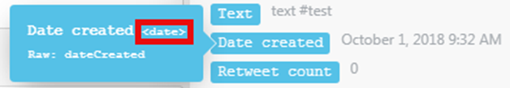
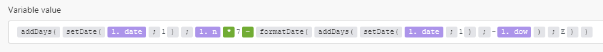
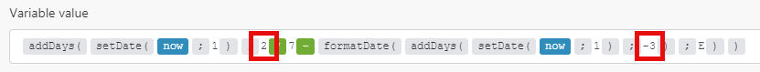
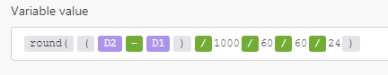

# Datum- en tijdfuncties

## Variabelen

### now

Haalt de huidige tijd in YYYY-MM-DD-hh :mm: s formaat op.

### tijdstempel

Hiermee wordt de huidige tijd opgehaald als Unix-tijdstempel.

## Functies

### [!UICONTROL addSeconds (date; number)]

Retourneert een nieuwe datum als gevolg van het toevoegen van een bepaald aantal seconden aan een datum. Voer een negatief getal in om seconden af te trekken.

>[!BEGINSHADEBOX]

**Voorbeelden:**

* `addSeconds(2016-12-08T15:55:57.536Z;2)`

  Keert 2016-12-08T15 :55: 59.536Z terug

* `addSeconds(2016-12-08T15:55:57.536Z;-2)`

  Keert 2016-12-08T15 :55: 55.536Z terug

>[!ENDSHADEBOX]

### [!UICONTROL addMinutes (date; number)] {#addminutes-date-number}

Retourneert een nieuwe datum als gevolg van het toevoegen van een bepaald aantal minuten aan een datum. Voer een negatief getal in om minuten af te trekken.

>[!BEGINSHADEBOX]

**Voorbeelden:**

* `addMinutes(2016-12-08T15:55:57.536Z;2)`

  Keert 2016-12-08T15 :57: 57.536Z terug

* `addMinutes(2016-12-08T15:55:57.536Z;-2)`

  Keert 2016-12-08T15 :53: 57.536Z terug

>[!ENDSHADEBOX]

### [!UICONTROL addHours (date; number)] {#addhours-date-number}

Retourneert een nieuwe datum als gevolg van het toevoegen van een bepaald aantal uren aan een datum. Voer een negatief getal in om het aantal uren af te trekken.

>[!BEGINSHADEBOX]

**Voorbeelden:**

* `addHours(2016-12-08T15:55:57.536Z; 2)`

  Keert 2016-12-08T17 :55: 57.536Z terug

* `addHours(2016-12-08T15:55:57.536Z;-2)`

  Keert 2016-12-08T13 :55: 57.536Z terug

>[!ENDSHADEBOX]

### [!UICONTROL addDays (date; number)] {#adddays-date-number}

Retourneert een nieuwe datum als gevolg van het toevoegen van een bepaald aantal dagen aan een datum. Voer een negatief getal in om dagen af te trekken.

>[!BEGINSHADEBOX]

**Voorbeelden:**

* `addDays(2016-12-08T15:55:57.536Z;2)`

  Keert 2016-12-10T15 :55: 57.536Z terug

* `addDays(2016-12-08T15:55:57.536Z;-2)`

  Keert 2016-12-6T15 :55: 57.536Z terug

>[!ENDSHADEBOX]

### [!UICONTROL addMonths (date; number)]

Retourneert een nieuwe datum als gevolg van het toevoegen van een bepaald aantal maanden aan een datum. Voer een negatief getal in om maanden af te trekken.

>[!BEGINSHADEBOX]

**Voorbeelden:**

* `addMonths(2016-08-08T15:55:57.536Z;2)`

  Keert 2016-10-08T15 :55: 57.536Z terug

* `addMonths(2016-08-08T15:55:57.536Z;-2)`

  Keert 2016-06-08T15 :55: 57.536Z terug

>[!ENDSHADEBOX]

### [!UICONTROL addYears (date; number)]

Retourneert een nieuwe datum als gevolg van het toevoegen van een bepaald aantal jaren aan een datum. Voer een negatief getal in om jaren af te trekken.

>[!BEGINSHADEBOX]

**Voorbeelden:**

* `addYears(2016-08-08T15:55:57.536Z;2)`

  Keert 2018-08-08T15 :55: 57.536Z terug

* `addYears(2016-12-08T15:55:57.536Z; -2)`

  Keert 2014-08-08T15 :55: 57.536Z terug

>[!ENDSHADEBOX]

### [!UICONTROL setSecond (date; number)]

Deze functie retourneert een nieuwe datum met de seconden die in parameters worden opgegeven.

Geef een getal op tussen 0 en 59. Als het getal zich buiten dat bereik bevindt, retourneert de functie een seconde vanaf de vorige minuut (voor een negatief getal) of een volgende minuut (voor een positief getal).

Als u een aantal buiten de waaier moet specificeren, adviseren wij dat u [!UICONTROL &#x200B; addSeconds] gebruikt, zoals hierboven beschreven in de sectie [ addSeconds (datum; aantal) ](#addseconds-date-number).

>[!BEGINSHADEBOX]

**Voorbeelden:**

* `setSecond(2015-10-07T11:36:39.138Z;10)`

  Keert 2015-10-07T11 :36: 10.138Z terug

* `setSecond(2015-10-07T11:36:39.138Z; 61)`

  Keert 2015-10-07T11 :37: 01.138Z terug

>[!ENDSHADEBOX]

### [!UICONTROL setMinute (date; number)]

Deze functie retourneert een nieuwe datum met de minuten die in parameters zijn opgegeven.

Geef een getal op tussen 0 en 59. Als het getal zich buiten dat bereik bevindt, retourneert de functie een minuut vanaf het vorige uur (voor een negatief getal) of het volgende uur (voor een positief getal).

Als u een aantal buiten de waaier moet specificeren, adviseren wij dat u addMinutes, zoals hierboven beschreven in [ addMinutes (datum; aantal) ](#addminutes-date-number) gebruikt.

>[!BEGINSHADEBOX]

**Voorbeelden:**

* `setMinute(2015-10-07T11:36:39.138Z;10)`

  Keert 2015-10-07T11 :10: 39.138Z terug

* `setMinute(2015-10-07T11:36:39.138Z;61)`

  Keert 2015-10-07T12 :01: 39.138Z terug

>[!ENDSHADEBOX]

### [!UICONTROL setHour (date; number)]

Deze functie retourneert een nieuwe datum met het uur dat in parameters is opgegeven.

Geef een getal op tussen 0 en 23. Als het getal zich buiten dit bereik bevindt, retourneert de functie een uur vanaf de vorige dag (voor een negatief getal) of volgende dag (voor een positief getal).

Als u een aantal buiten de waaier moet specificeren, adviseren wij dat u addHours, zoals hierboven beschreven in [ addHours (datum; aantal) ](#addhours-date-number) gebruikt.

>[!BEGINSHADEBOX]

**Voorbeelden:**

* `setHour(2015-08-07T11:36:39.138Z;6)`

  Keert 2015-08-07T06 :36: 39.138Z terug

* `setHour(2015-08-07T11:36:39.138;-6)`

  Keert 2015-08-06T18 :36: 39.138Z terug

>[!ENDSHADEBOX]

### [!UICONTROL setDay (date; number/name of the day in English)]

Deze functie retourneert een nieuwe datum met de dag die in parameters wordt opgegeven.

U kunt deze functie gebruiken om de dag van de week in te stellen, met zondag als 1 en zaterdag als 7. Als u een getal tussen 1 en 7 opgeeft, valt de resulterende datum binnen de huidige week (zondag tot zaterdag). Als het getal zich buiten dat bereik bevindt, retourneert de functie een dag vanaf de vorige week (voor een negatief getal) of volgende week (voor een positief getal).

Als u een aantal buiten de waaier moet specificeren, adviseren wij dat u addDays gebruikt, zoals hierboven beschreven in [ addDays (datum; aantal) ](#adddays-date-number).

>[!BEGINSHADEBOX]

**Voorbeelden:**

* `setDay(2018-06-27T11:36:39.138Z;Monday)`

  Keert 2018-06-25T11 :36: 39.138Z terug

* `setDay(2018-06-27T11:36:39.138Z;1)`

  Keert 2018-06-24T11 :36: 39.138Z terug

* `setDay(2018-06-27T11:36:39.138Z;7)`

  Keert 2018-06-30T11 :36: 39.138Z terug

>[!ENDSHADEBOX]

### [!UICONTROL setDate (date; number)]

Deze functie retourneert een nieuwe datum met de dag van de maand die in parameters is opgegeven.

Geef een getal op tussen 1 en 31. Als het getal zich buiten dit bereik bevindt, retourneert de functie een dag vanaf de vorige maand (voor een negatief getal) of de volgende maand (voor een positief getal).

>[!BEGINSHADEBOX]

**Voorbeelden:**

* `setDate(2015-08-07T11:36:39.138Z;5)`

  Keert 2015-08-05T11 :36: 39.138Z terug

* `setDate(2015-08-07T11:36:39.138Z;32)`

  Keert 2015-09-01T11 :36: 39.138Z terug

>[!ENDSHADEBOX]

### [!UICONTROL setMonth (date; number/name of the month in English)]

Deze functie retourneert een nieuwe datum met de maand die in parameters is opgegeven.

Geef een getal op tussen 1 en 12. Als het getal zich buiten dit bereik bevindt, retourneert de functie de maand in het voorgaande jaar (voor een negatief getal) of het daaropvolgende jaar (voor een positief getal).

>[!BEGINSHADEBOX]

**Voorbeelden:**

* `setMonth(2015-08-07T11:36:39.138Z;5)`

  Keert 2015-05-07T11 :36: 39.138Z terug

* `setMonth(2015-08-07T11:36:39.138Z;17)`

  Keert 2016-05-07T11 :36: 39.138Z terug

* `setMonth(2015-08-07T11:36:39.138Z;january)`

  Keert 2015-01-07T12 :36: 39.138Z terug

>[!ENDSHADEBOX]

### [!UICONTROL setYear (date; number)]

Retourneert een nieuwe datum met het jaar dat in parameters is opgegeven.

>[!BEGINSHADEBOX]

**Voorbeeld:**

* `setYear(2015-08-07T11:36:39.138Z;2017)`

  Keert 2017-08-07T11 :36: 39.138Z terug

>[!ENDSHADEBOX]

### [!UICONTROL formatDate (date; format; [timezone])]

Gebruik deze functie wanneer u een Date-waarde hebt, zoals `12-10-2021 20:30` , die u wilt opmaken als een Text-waarde, zoals `Dec 10, 2021 8:30 PM` .

Dit is bijvoorbeeld handig wanneer u de datumnotatie van een app of webservice wilt wijzigen in die van een verbonden app of webservice in hetzelfde scenario.

Voor meer informatie, zie Datum en Tekst in het artikel [ gegevenstypes van het Punt ](/help/workfront-fusion/references/mapping-panel/data-types/item-data-types.md).

#### Parameters

<table style="table-layout:auto"> 
 <col> 
 <col> 
 <col> 
 <thead> 
  <tr> 
   <th>Parameter</th> 
   <th>Verwacht gegevenstype* </th> 
   <th>Wat doet het?</th> 
  </tr> 
 </thead> 
 <tbody> 
  <tr> 
   <td>[!UICONTROL date] </td> 
   <td>Datum </td> 
   <td> <p>Zet een Date-waarde om in een Text-waarde. </p> </td> 
  </tr> 
  <tr> 
   <td>[!UICONTROL format] </td> 
   <td>Tekst </td> 
   <td> <p>Hiermee kunt u een notatie opgeven met tokens voor datum-/tijdnotaties. Voor meer informatie, zie <a href="/help/workfront-fusion/references/mapping-panel/functions/tokens-for-date-and-time-formatting.md" class="MCXref xref"> Tokens voor datum en tijd het formatteren </a>.</p> <p class="example" data-mc-autonum="<b>Example: </b>"><span class="autonumber"><span><b> Voorbeeld: </b></span></span><code>DD.MM.YYYY HH:mm</code> </p> </td> 
  </tr> 
  <tr> 
   <td>[!UICONTROL timezone] </td> 
   <td>Tekst </td> 
   <td> <p>(Optioneel) Hiermee kunt u de tijdzone opgeven die wordt gebruikt voor de conversie. </p> <p>Voor de lijst van erkende tijdzones, zie de "TZ- gegevensbestandnaam"kolom in de Wikipedia <a href="https://en.wikipedia.org/wiki/List_of_tz_database_time_zones"> Lijst van de tijdstreken van de het gegevensbestandtijd van tz </a>. Alleen de waarden in deze kolom worden door de functie herkend als een geldige tijdzone. Eventuele andere waarden worden genegeerd en in plaats daarvan wordt de tijdzone van de scenario's gebruikt die in het profiel is opgegeven. </p> <p>Als u deze parameter weglaat, wordt de tijdzone van Scenario's toegepast die in uw montages van het Profiel wordt gespecificeerd. </p> <p class="example" data-mc-autonum="<b>Example: </b>"><span class="autonumber"><span><b> Voorbeeld: </b></span></span><code>Europe/Prague</code>, <code>UTC</code></p> </td> 
  </tr> 
 </tbody> 
</table>

Wanneer een ander type is opgegeven, wordt typeafgedwongen. Voor meer informatie, zie [ Druk van het Type ](/help/workfront-fusion/references/mapping-panel/data-types/type-coercion.md).

#### Retourwaarde en type

De functie `formatDate` retourneert een tekstrepresentatie van de opgegeven waarde Date volgens de opgegeven indeling en tijdzone. Het gegevenstype is Text.

>[!BEGINSHADEBOX]

**Voorbeelden:** Scenario en timezone van het Web werden allebei geplaatst aan `Europe/Prague` in deze voorbeelden.



* `formatDate(1. Date created;MM/DD/YYYY)`

  Returns 10/01/2018

* `formatDate(1. Date created; YYYY-MM-DD hh:mm A)`

  Returns 2018-10-01 09:32 AM

* `formatDate(1. Date created;DD.MM.YYYY HH:mm;UTC)`

  Retourneert 01.10.2018 07:32

* `formatDate(now;DD.MM.YYYY HH:mm)`

  Retourneert 19.03.2019 15:30

>[!ENDSHADEBOX]

### [!UICONTROL parseDate (text; format; [timezone])]

Gebruik deze functie wanneer u een tekstwaarde hebt die een datum vertegenwoordigt (zoals `12-10-2019 20:30` of `Aug 18, 2019 10:00 AM`) en u deze wilt omzetten (parseren) in een Date-waarde (een binaire machineleesbare representatie). Voor meer informatie, zie Datum en Tekst in het artikel [ gegevenstypes van het Punt ](/help/workfront-fusion/references/mapping-panel/data-types/item-data-types.md).

#### Parameters

De tweede kolom geeft het verwachte type aan. Wanneer een ander type is opgegeven, wordt typeafgedwongen. Voor meer informatie, zie [ Druk van het Type ](/help/workfront-fusion/references/mapping-panel/data-types/type-coercion.md).

<table style="table-layout:auto"> 
 <col> 
 <col> 
 <col> 
 <thead> 
  <tr> 
   <th>Parameter</th> 
   <th>Verwacht gegevenstype* </th> 
   <th>Wat doet het?</th> 
  </tr> 
 </thead> 
 <tbody> 
  <tr> 
   <td>[!UICONTROL text] </td> 
   <td>Tekst </td> 
   <td> <p>Zet een Date-waarde om in een Text-waarde. </p> </td> 
  </tr> 
  <tr> 
   <td>[!UICONTROL format] </td> 
   <td>Tekst </td> 
   <td> <p>Hiermee kunt u een notatie opgeven met tokens voor datum-/tijdnotaties. Voor meer informatie, zie <a href="/help/workfront-fusion/references/mapping-panel/functions/tokens-for-date-and-time-formatting.md" class="MCXref xref"> Tokens voor datum en tijd het formatteren </a>.</p> <p class="example" data-mc-autonum="<b>Example: </b>"><span class="autonumber"><span><b> Voorbeeld: </b></span></span><code>DD.MM.YYYY HH:mm</code> </p> </td> 
  </tr> 
  <tr> 
   <td>[!UICONTROL timezone] </td> 
   <td>Tekst </td> 
   <td> <p>(Optioneel) Hiermee kunt u de tijdzone opgeven die wordt gebruikt voor de conversie. </p> <p>Voor de lijst van erkende tijdzones, zie de "TZ- gegevensbestandnaam"kolom in de Wikipedia <a href="https://en.wikipedia.org/wiki/List_of_tz_database_time_zones"> Lijst van de tijdstreken van de het gegevensbestandtijd van tz </a>. Alleen de waarden in deze kolom worden door de functie herkend als een geldige tijdzone. Eventuele andere waarden worden genegeerd en in plaats daarvan wordt de tijdzone van de scenario's gebruikt die in het profiel is opgegeven. </p> <p>Als u deze parameter weglaat, wordt de tijdzone van Scenario's toegepast die in uw montages van het Profiel wordt gespecificeerd.</p> <p class="example" data-mc-autonum="<b>Example: </b>"><span class="autonumber"><span><b> Voorbeeld: </b></span></span><code>Europe/Prague</code>, <code>UTC</code></p> </td> 
  </tr> 
 </tbody> 
</table>

Wanneer een ander type is opgegeven, wordt typeafgedwongen. Voor meer informatie, zie [ Druk van het Type ](/help/workfront-fusion/references/mapping-panel/data-types/type-coercion.md).

#### Retourwaarde en type

Deze functie converteert een tekstreeks naar een datum op basis van de notatie en tijdzone die u opgeeft. Het gegevenstype van de waarde is Date.

>[!BEGINSHADEBOX]

**Voorbeelden:** In de volgende voorbeelden, wordt de teruggekeerde waarde van de Datum uitgedrukt volgens ISO 8601, maar het gegevenstype van het resultaat is Datum.

* `parseDate(2016-12-28;YYYY-MM-DD)`

  Keert 2016-12-28T00 :00: 00.000Z terug

* `parseDate(2016-12-28 16:03;YYYY-MM-DD HH:mm)`

  Keert 2016-12-28T16 :03: 00.000Z terug

* `parseDate(2016-12-28 04:03 pm; YYYY-MM-DD hh:mm a)`

  Keert 2016-12-28T16 :03: 06.000Z terug

* `parseDate(1482940986;X)`

  Keert 2016-12-28T16 :03: 06.000Z terug

>[!ENDSHADEBOX]

### [!UICONTROL dateDifference (Date1; Date2; Unit)]

Retourneert een getal dat het verschil in de twee datums vertegenwoordigt, uitgedrukt in de opgegeven eenheid.

Date2 wordt afgetrokken van Date1.

Gebruik een van de volgende tijdwaarden voor de parameter `unit` :

* milliseconden
* seconden
* minuten
* uren
* dagen
* weken
* maanden

Als er geen eenheid is opgegeven, retourneert de functie het verschil in milliseconden.

>[!BEGINSHADEBOX]

**Voorbeelden:**

* `dateDifference(2021-05-11T18:10:00.000Z;2021-05-11T18:00:00.000Z)`

  Retourneert `600,000`

* `dateDifference(2021-05-11T18:10:00.000Z;2021-05-11T18:00:00.000Z;hours)`

  Retourneert `4`

* `dateDifference2021-06-11T18:10:00.000Z;2021-05-11T18:00:00.000Z;months)`

  Retourneert `1`

>[!ENDSHADEBOX]

### Aanvullende voorbeelden

#### Hoe wordt de n-de dag van de week in de maand berekend

Deze sectie is aangepast voor [!DNL Workfront Fusion] op de [!DNL Exceljet] -webpagina waarin wordt uitgelegd hoe u de negende dag van de week in een maand kunt ophalen.

Als u een datum wilt berekenen die overeenkomt met de n-de dag van de week in de maand (bijvoorbeeld, eerste dinsdag, derde vrijdag, enzovoort), kunt u de volgende formule gebruiken:



```
{{addDays(setDate(1.date; 1); 1.n * 7 - formatDate(addDays(setDate(1.date; 1); "-" + 1.dow); "E"))}}
```

De formule bevat de volgende items:

<table style="table-layout:auto"> 
 <col> 
 <col> 
 <tbody> 
  <tr> 
   <td><code>1.n</code> </td> 
   <td> <p> n-de dag:</p> 
    <ul> 
     <li><code>1</code> voor 1e dinsdag</li> 
     <li><code>2</code> voor de tweede dinsdag</li> 
     <li><code>3</code> voor de derde dinsdag enzovoort</li> 
    </ul> </td> 
  </tr> 
  <tr> 
   <td><code>2.dow</code> </td> 
   <td> <p> weekdag:</p> 
    <ul> 
     <li><code>1</code> voor maandag</li> 
     <li><code>2</code> voor dinsdag</li> 
     <li><code>3</code> voor woensdag</li> 
     <li><code>4</code> voor donderdag</li> 
     <li><code>5</code> voor vrijdag</li> 
     <li><code>6</code> voor zaterdag</li> 
     <li><code>7</code> voor zondag</li> 
    </ul> </td> 
  </tr> 
  <tr> 
   <td><code>1.date</code> </td> 
   <td> <p> De datum bepaalt de maand. Als u de n-de dag van de week in de huidige maand wilt berekenen, gebruikt u de variabele <code>now</code> .</p> </td> 
  </tr> 
 </tbody> 
</table>

Als u bijvoorbeeld slechts één specifiek geval wilt berekenen, kunt u de items `1.n` en `2.dow` in de formule vervangen door de corresponderende getallen. Voor de tweede woensdag in de huidige maand, zou u de volgende waarden gebruiken:

* `1.n` = `2`
* `1.dow` = `3`
* `1.date` = `now`



#### Uitleg:

* `setDate(now;1)` retourneert het eerste van de huidige maand
* `formatDate(....;E)` retourneert de dag van de week (1, 2, ... 6)

### Hoe te om dagen tussen data te berekenen

Een mogelijkheid is om de volgende expressie te gebruiken:



```
{{round((2.value - 1.value) / 1000 / 60 / 60 / 24)}}
```

>[!NOTE]
>
>* Waarden van `D1` en `D2` moeten waarden van het type Date zijn. Wanneer het tekenreekstypewaarden zijn (bijvoorbeeld 20.10.2018), gebruikt u de functie `parseDate()` om deze om te zetten in datumtekstwaarden.
>
>* De functie `round()` wordt gebruikt voor gevallen waarin een van de datums binnen de zomertijdperiode valt en de andere niet. In deze gevallen is het verschil in uren één uur minder of meer. U kunt het door 24 voor een niet-geheel resultaat verdelen. Je verliest een uurtje spaargeld. Rond afgevlakt het zodat u geen percentage hebt

#### Laatste dag/milliseconde van maand berekenen

Wanneer u een datumwaaier, bijvoorbeeld in een onderzoeksmodule specificeert, als de waaier de volledige vorige maand als gesloten interval (het interval overspant dat beide zijn limietpunten omvat), moet u de laatste dag van de maand berekenen.

2019-09-01 ≤ D ≤ 2019-09-30

In de onderstaande formule wordt een manier getoond om de laatste dag van de voorgaande maand te berekenen:


```
{{addDays(setDate(now; 1); -1)}}
```

In sommige gevallen moet u niet alleen de laatste dag van de maand berekenen, maar ook letterlijk de laatste milliseconde:

2019-09-01T00 :00: 00.000Z ≤ D ≤ 2019-09-30T23 :59: 59.999Z

Deze formule toont één manier hoe te om laatste milliseconden van de vorige maand te berekenen:


```
{{parseDate(parseDate(formatDate(now; "YYYYMM01"); "YYYYMMDD"; "UTC") - 1; "x")}}
```

Laat het UTC-argument weg als u het resultaat nodig hebt om de tijdzoneinstelling te gebruiken:

 weg

`{{parseDate(parseDate(formatDate(now; "YYYYMM01"); "YYYYMMDD") - 1; "x")}}`

Het is echter aan te raden in plaats daarvan halfopen interval te gebruiken (het interval waarbij een van de limietpunten wordt uitgesloten), waarbij in plaats daarvan de eerste dag van de volgende maand wordt opgegeven en de operator &quot;kleiner of gelijk aan&quot; als volgt wordt vervangen door &quot;kleiner dan&quot;:

`2019-09-01 ≤ D < 2019-10-01`

`2019-09-01T00:00:00.000Z ≤ D < 2019-10-01T00:00:00.000Z`
