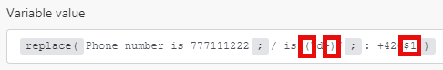

# Reeksfuncties

## [!UICONTROL length (text or buffer)]

Retourneert de lengte van de tekstreeks (aantal tekens) of binaire buffer (buffergrootte in bytes).

>[!BEGINSHADEBOX]

**Voorbeeld:**

`length( hello )`

Retourneert: 5

>[!ENDSHADEBOX]

## [!UICONTROL lower (text)]

Hiermee worden alle alfabetische tekens in een tekstreeks omgezet in kleine letters.

>[!BEGINSHADEBOX]

**Voorbeeld:**

`lower( Hello )`

Retourneert: hello

>[!ENDSHADEBOX]

## [!UICONTROL capitalize (text)]

Zet het eerste teken in een tekstreeks om in hoofdletters.

>[!BEGINSHADEBOX]

**Voorbeeld:**

`capitalize( workfront )`

Retourneert: [!DNL Workfront]

>[!ENDSHADEBOX]

## [!UICONTROL startcase (text)]

Hiermee zet u de eerste letter van elk woord om in hoofdletters en alle andere letters in kleine letters.

>[!BEGINSHADEBOX]

**Voorbeeld:**
`startcase( hello WORLD )`

Retourneert: [!UICONTROL Hello World]

>[!ENDSHADEBOX]

## [!UICONTROL ascii (text; [remove diacritics])]

Hiermee worden alle niet-ascii-tekens uit een tekstreeks verwijderd.

>[!BEGINSHADEBOX]

**Voorbeelden:**

* `ascii(` `Wěošrčkřfžrýoáníté` `)`

Retourneert: [!DNL Workfront]

* `ascii(` `ěščřž` `;` `true` `)`

Retourneert: [!UICONTROL escrz]

>[!ENDSHADEBOX]

## [!UICONTROL replace (text;search string; replacement string)]

Vervangt de zoekreeks door de nieuwe tekenreeks.

>[!BEGINSHADEBOX]

**Voorbeeld:**

`replace( Hello World ; Hello ; Hi )`

Retourneert: [!UICONTROL Hi World]

>[!ENDSHADEBOX]

Reguliere expressies (ingesloten in `/.../` ) kunnen worden gebruikt als zoekreeks met een combinatie van markeringen (zoals `g` , `i` , `m` ) toegevoegd:

>[!BEGINSHADEBOX]

**Voorbeeld:**

Al deze getallen X X X X worden vervangen door X

>[!ENDSHADEBOX]

De vervangende tekenreeks kan de volgende speciale vervangingspatronen bevatten:

* `$&` Voegt de overeenkomende subtekenreeks in.
* `$n` Wanneer n een positief geheel getal is dat kleiner is dan 100, wordt de tweede overeenkomende tekenreeks tussen haakjes ingevoegd. Dit is 1-geïndexeerd.

>[!BEGINSHADEBOX]

**Voorbeelden:**

Retourneert: Telefoonnummer `+420777111222`

Retourneert: Telefoonnummer: `+420777111222`

>[!CAUTION]
>
>Gebruik geen benoemde vastleggingsgroepen, zoals `/ is (?<number>\d+)/` in het vervangende tekenreeksargument. Dit resulteert in een fout.

>[!ENDSHADEBOX]

Voor meer informatie over regelmatige uitdrukkingen, zie [ syntactische parser van de Tekst ](/help/workfront-fusion/references/apps-and-modules/tools-and-transformers/text-parser.md).

## [!UICONTROL trim (text)]

Hiermee verwijdert u spaties aan het begin of einde van de tekst.

## [!UICONTROL upper (text)]

Zet alle alfabetische tekens in een tekstreeks om in hoofdletters.

>[!BEGINSHADEBOX]

**Voorbeeld:**

`upper( Hello )`

Retourneert: [!UICONTROL HELLO]

>[!ENDSHADEBOX]

## [!UICONTROL substring (text; start;end)]

Retourneert een gedeelte van een tekstreeks tussen de positie &quot;start&quot; en &quot;end&quot;.

>[!BEGINSHADEBOX]

**Voorbeelden:**

* `substring( Hello ; 0 ; 3)`

  Retourneert: Help

* `substring( Hello ; 1 ; 3 )`

  Retourneert: el

>[!ENDSHADEBOX]

## [!DNL indexOf (string; value; [start])]

Retourneert de positie van de eerste instantie van een opgegeven waarde in een tekenreeks. Deze methode retourneert &#39;-1&#39; als de waarde waarnaar wordt gezocht er niet is. De beginwaarde geeft aan waar in de tekenreeks de zoekopdracht moet beginnen.

>[!BEGINSHADEBOX]

**Voorbeelden:**

* `indexOf( Workfront ; o )`

  Retourneert: 1

* `indexOf( Workfront ; x )`

  Retourneert: -1

* `indexOf( Workfront ; o ; 3 )`

  Retourneert: 6

>[!ENDSHADEBOX]

## [!UICONTROL toBinary (value)]

Zet om het even welke waarde in binaire gegevens om.

U kunt het coderen als tweede argument ook specificeren om binaire omzettingen van hexuitdraai of base64 op binaire gegevens toe te passen.

>[!BEGINSHADEBOX]

**Voorbeelden:**

* `toBinary( Workfront )`

  Retourneert: 57 6f 72 6b 66 72 6f 6e 74

* `toBinary( V29ya2Zyb250 ; base64 )`

  Retourneert: 57 6f 72 6b 66 72 6f 6e 74

>[!ENDSHADEBOX]

## [!UICONTROL toString (value)]

Zet een waarde om in een tekenreeks.

## [!UICONTROL encodeURL (text)]

Codeert speciale tekens in bepaalde tekst naar een geldig URL-adres.

## [!UICONTROL decodeURL (text)]

Hiermee worden speciale tekens in een URL gedecodeerd naar tekst.

>[!BEGINSHADEBOX]

**Voorbeeld:**
`decodeURL( Automate%20your%20workflow )`

Retourneert: [!UICONTROL Automate your workflow]

>[!ENDSHADEBOX]

## [!UICONTROL escapeHTML (text)]

Hiermee kunt u alle HTML-tags in tekst laten knippen.

>[!BEGINSHADEBOX]

**Voorbeeld:**

`escapeHTML( <b>Hello</b> )`

Retourneert: `&lt;b&gt;Hello&lt;/b&gt;`

>[!ENDSHADEBOX]

## [!UICONTROL escapeMarkdown(text)]

Hiermee kunt u alle markeringen voor markeringen in tekst laten knippen.

>[!BEGINSHADEBOX]

**Voorbeeld:**

`escapeMarkdown( # Header )`

Retourneert: `&#35; Header`

>[!ENDSHADEBOX]

## [!UICONTROL stripHTML (text)]

Hiermee verwijdert u alle HTML-tags uit tekst.

>[!BEGINSHADEBOX]

**Voorbeeld:**

`stripHTML( <b>Hello</b> )`

Retourneert: Hello

>[!ENDSHADEBOX]

## contains (text; search string)

Controleert of tekst de zoektekenreeks bevat.

>[!BEGINSHADEBOX]

**Voorbeelden:**

* `contains( Hello World ; Hello )`

  Retourneert: [!UICONTROL true]

* `contains( Hello World ; Bye )`

  Retourneert: [!UICONTROL false]

>[!ENDSHADEBOX]

## [!UICONTROL split (text; separator)]

Splitst een tekenreeks in een array van tekenreeksen door de tekenreeks in subtekenreeksen te scheiden.

>[!BEGINSHADEBOX]

**Voorbeeld:**

`split( John, George, Paul ; , )`

>[!ENDSHADEBOX]

## [!UICONTROL md5 (text)]

Berekent de md5 hash van een tekenreeks.

>[!BEGINSHADEBOX]

**Voorbeeld:**

`md5( Workfront )`

Retourneert: `1448bbbeaa7a9b8091d426999f1f666b`

>[!ENDSHADEBOX]

## [!UICONTROL sha1 (text; [encoding]; [key])]

Berekent de sha1 hash van een tekenreeks. Als het belangrijkste argument wordt gespecificeerd, is sha1 HMAC hash in plaats daarvan teruggekeerd. Ondersteunde coderingen: &quot;hex&quot; (standaardwaarde), &quot;base64&quot; of &quot;latin1&quot;.

>[!BEGINSHADEBOX]

**Voorbeeld:**

`sha1( workfront )`

Retourneert: b2b30b8ae1f9e5b40fbb0696eaabdbfd8d0c087f

>[!ENDSHADEBOX]

## [!UICONTROL sha256 (text; [encoding]; [key])]

Berekent de sha256 hash van een tekenreeks. Als het zeer belangrijke argument wordt gespecificeerd, sha256 hash HMAC in plaats daarvan is teruggekeerd. Ondersteunde coderingen: &quot;hex&quot; (standaardwaarde), &quot;base64&quot; of &quot;latin1&quot;.>

>[!BEGINSHADEBOX]

**Voorbeeld:**

`sha256( workfront )`

Retourneert: ed3d7397eec7b94453035b67ba4468c883ee3bedeb57137f7371f2e0cf5e2bbc

>[!ENDSHADEBOX]

## [!UICONTROL sha512 (text; [output encoding]; [key]; [key encoding])]

Berekent de sha512 hash van een tekenreeks. Als het belangrijkste argument wordt gespecificeerd, sha512 hash HMAC is in plaats daarvan teruggekeerd.

Ondersteunde coderingen:

* &quot;[!UICONTROL hex]&quot; (standaardwaarde)
* &quot;[!UICONTROL base64]&quot;
* &quot;[!UICONTROL latin1]&quot;

Ondersteunde toetscoderingen:

* &quot;[!UICONTROL text]&quot; (standaardwaarde)
* &quot;[!UICONTROL hex]&quot;
* &quot;[!UICONTROL base64]&quot; of &quot;[!UICONTROL binary]&quot;

Wanneer u &quot;[!UICONTROL binary]&quot;-toetscodering gebruikt, moet een sleutel een buffer zijn, niet een tekenreeks.

>[!BEGINSHADEBOX]

**Voorbeeld:**

`sha512(workfront)`

Retourneert: 789ae41b9456357e4f27c6a09956a767abbb8d80b206003ffdd1e94dbc687cd11 9b85e1e19db58bb44b234493af35fd431639c0345adf2cf7ec26e9f4a7fb19

>[!ENDSHADEBOX]

## [!UICONTROL base64 (text)]

Transformeert tekst naar base64.

>[!BEGINSHADEBOX]

**Voorbeeld:**

`base64( workfront )`

Retourneert: d29ya2Zyb250==

>[!ENDSHADEBOX]
