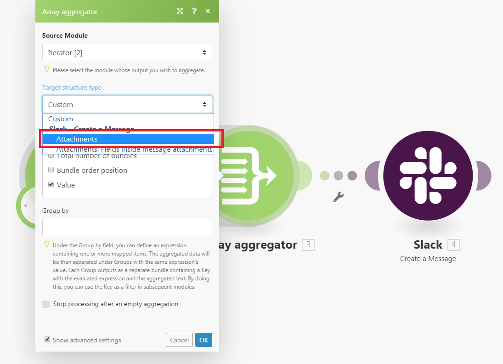

# [!UICONTROL Aggregator] module

Een aggregatormodule is een module die verschillende bundels gegevens samenvoegt tot één bundel.

## Toegangsvereisten

+++ Breid uit om de toegangseisen voor de functionaliteit in dit artikel weer te geven.

U moet de volgende toegang hebben om de functionaliteit in dit artikel te kunnen gebruiken:

<table style="table-layout:auto">
 <col> 
 <col> 
 <tbody> 
  <tr> 
    <td role="rowheader">[!DNL Adobe Workfront] package</td> 
   <td> 
Alle
 </td> 
  </tr> 
  <tr data-mc-conditions=""> 
   <td role="rowheader">[!DNL Adobe Workfront] licentie</td> 
   <td> Nieuw: Standaard
of

Huidig: Werk of hoger
 </td> 
  </tr> 
  <tr> 
   <td role="rowheader">[!UICONTROL Adobe Workfront Fusion] licentie</td> 
   <td>
   
Huidig: Geen [!DNL Workfront Fusion] vereiste licentie.

   
of

   
Verouderd: alle 

   </td> 
  </tr> 
  <tr> 
   <td role="rowheader">Product</td> 
   <td>
   
Nieuw:
 <ul><li>[!UICONTROL Select] of [!UICONTROL Prime] [!DNL Workfront] -abonnement: uw organisatie moet het abonnement aanschaffen [!DNL Adobe Workfront Fusion] .</li><li>[!UICONTROL Ultimate] [!DNL Workfront] abonnement: [!DNL Workfront Fusion] is opgenomen.</li></ul>
   
of

   
Huidig: Uw organisatie moet [!DNL Adobe Workfront Fusion] aanschaffen.

   </td> 
  </tr>
 </tbody> 
</table>

Neem contact op met de [!DNL Workfront] -beheerder als u wilt weten welk abonnement, licentietype of toegang u hebt.

Voor informatie over de vergunningen van de Fusie van Adobe Workfront, zie [[!DNL Adobe Workfront Fusion]  vergunningen ](/help/workfront-fusion/set-up-and-manage-workfront-fusion/licensing-operations-overview/license-automation-vs-integration.md).

+++

## Overzicht van de module [!UICONTROL Aggregator]

Wanneer een module [!UICONTROL Aggregator] wordt uitgevoerd, doet deze het volgende:

* Accumuleert alle bundels van de verrichting van één enkele bronmodule.
* Hiermee wordt één bundel uitgevoerd met een array die één item per geaccumuleerde bundel bevat. De inhoud van de items van de array is afhankelijk van de specifieke module [!UICONTROL Aggregator] en de instelling ervan.

In de volgende afbeelding ziet u een standaard instelling van de module [!UICONTROL Aggregator] :

<table style="table-layout:auto">
 <col> 
 <col> 
 <tbody> 
  <tr> 
   <td> 
[!UICONTROL Source Module]
 </td> 
   <td> 
De module waar de bundelaggregatie begint. De bronmodule is gewoonlijk een iterator of een onderzoeksmodule die een reeks bundels uitvoert.

Wanneer u opstelling de bronmodule van de aggregator (en de opstelling van de aggregator sluit), wordt de route tussen de bronmodule en de samenvoegersmodule verpakt in een grijs gebied, zodat u duidelijk het begin en het eind van de samenvoeging kunt zien. 
   
 
Voor meer informatie over iterators, zie <a href="/help/workfront-fusion/references/modules/iterator-module.md" class="MCXref xref">[!UICONTROL Iterator] module </a>.
 
   
Voor meer informatie over onderzoeksmodules zie <a href="/help/workfront-fusion/get-started-with-fusion/understand-fusion/module-overview.md#search-modules" class="MCXref xref"> modules van het Onderzoek </a> in het overzicht van de Module.
 </td> 
  </tr> 
  <tr> 
   <td> 
[!UICONTROL Target structure type]

(Alleen van toepassing op de module [!UICONTROL Array aggregator] .)
 </td> 
   <td> 
 De doelstructuur waar de gegevens worden geaggregeerd. Met de standaardoptie [!UICONTROL Custom] kunt u items kiezen die moeten worden samengevoegd in het item <code>Array </code> van de uitvoerbundel van [!UICONTROL Array aggregator]  :
 
  
 
Nadat u meer modules na de [!UICONTROL Array aggregator] module aansluit, en aan de opstelling van de samenvoegersmodule terugkeert, bevat het [!UICONTROL Target] drop-down menu van het structuurtype alle volgende modules en hun gebieden die "Serie van Inzamelingen"type zijn. 
In dit voorbeeld wordt het [!UICONTROL Attachments] veld van de module [!DNL Slack] &gt; [!UICONTROL Create a Message] weergegeven in het veld Array aggregator &gt; Doelstructuurtype. 
 
  
 </td> 
  </tr> 
  <tr> 
   <td>[!UICONTROL Aggregated fields]</td> 
   <td>De velden die u wilt opnemen in de uitvoer van de aggregatormodule.</td> 
  </tr> 
  <tr> 
   <td> 
[!UICONTROL Group by]
 </td> 
   <td> 
Met het veld Groep per veld kunt u een expressie definiëren die een of meer in kaart gebrachte items bevat. De geaggregeerde gegevens worden vervolgens in Groepen gescheiden door de waarde van de expressie. Elke groep voert als een afzonderlijke bundel uit, die een Sleutel en een serie van gegevens bevat. Door resultaten te groeperen, kunt u Sleutel als filter in verdere modules gebruiken.

   
Elke bundel bevat twee items:
 
    <ul> 
     <li><code>Key</code>: De waarde waarop u groepeert.</li> 
     <li><code>Array</code>: De geaggregeerde gegevens van de bundels waarvoor de formule de waarde <code>Key</code> heeft geëvalueerd.</li> 
    </ul> </td> 
  </tr> 
  <tr> 
   <td> 
Verwerking stoppen na een lege aggregatie
 </td> 
   <td> 
Standaard geeft de module [!UICONTROL Aggregator] het resultaat van de aggregatie door, zelfs als geen bundels de module [!UICONTROL Aggregator] hebben bereikt (omdat ze bijvoorbeeld allemaal zijn gefilterd uit het pad dat de aggregator bevat). Als de optie [!UICONTROL Stop processing after an empty aggregation] is ingeschakeld, produceert de module [!UICONTROL Aggregator] geen uitvoerbundel wanneer er geen invoerbundels zijn. In plaats daarvan stopt de stroom.
 </td> 
  </tr> 
 </tbody> 
</table>

>[!NOTE]
>
>Bundels die worden gegenereerd door modules tussen de bronmodule en de module [!UICONTROL Aggregator] , worden niet uitgevoerd door de module [!UICONTROL Aggregator] . Deze bundels zijn niet toegankelijk door de modules in de stroom na [!UICONTROL Aggregator]. Als u gegevens nodig hebt uit een bundel die is uitgevoerd door een module tussen de bronmodule en de module [!UICONTROL Aggregator] , moet u het opgegeven item opnemen in de instelling van de module [!UICONTROL Aggregator] (bijvoorbeeld in het veld [!UICONTROL Aggregated fields] in de installatie van de module [!UICONTROL Array aggregator] ).

## Voorbeeldscenario waarin wordt beschreven hoe aggregators werken

In dit voorbeeldscenario wordt getoond hoe u alle e-mailbijlagen kunt comprimeren en de ZIP naar [!DNL Dropbox] kunt uploaden.

In het onderstaande scenario wordt getoond hoe u:

* De eerste module kijkt een brievenbus voor inkomende e-mail. De trigger [!UICONTROL Email] > [!UICONTROL Watch emails] geeft een bundel met item `Attachments[]` weer. Dit is een array die alle bijlagen van de e-mail bevat.

* In het tweede model worden de bijlagen van de e-mail herhaald: [!UICONTROL Email] > [!UICONTROL Iterate attachments] iterator neemt de items van de array `Attachments[]` een voor een en verzendt deze verder als afzonderlijke bundels.

* De derde module is de aggregator. Het aggregeert de bundels die door de [!UICONTROL Email] > [!UICONTROL Iterate attachments] module worden uitgevoerd. [!UICONTROL Archive] > [!UICONTROL Create an archive aggregator] accumuleert alle bundels het ontvangt en output één enkele bundel die het dossier van het PIT bevat.

* De laatste module uploadt het resulterende ZIP-bestand naar [!DNL Dropbox] .  [!DNL Dropbox] > [!UICONTROL Upload a file] verkrijgt het ZIP-bestand via de module [!UICONTROL Archive] > [!UICONTROL Create an archive] en uploadt het bestand naar [!DNL Dropbox] .

Hieronder ziet u een voorbeeldinstelling van de aggregator [!UICONTROL Archive] > [!UICONTROL Create an archive] :

