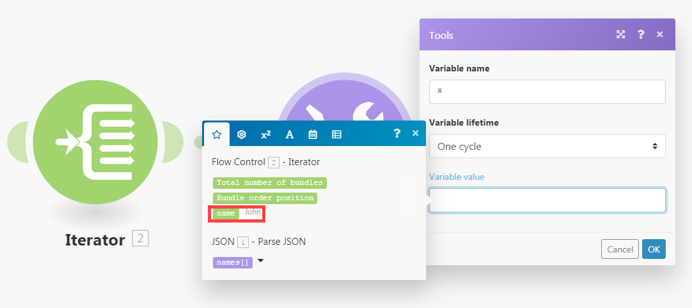

# [!UICONTROL Iterator] module

Een [!UICONTROL Iterator] is een type module dat een array omzet in een reeks bundels. Elk arrayitem wordt als een afzonderlijke bundel uitgevoerd.

## Toegangsvereisten

+++ Breid uit om de toegangseisen voor de functionaliteit in dit artikel weer te geven.

<table style="table-layout:auto">
 <col> 
 <col> 
 <tbody> 
  <tr> 
   <td role="rowheader">Adobe Workfront-pakket</td> 
   <td> 
Elk Adobe Workfront Workflow-pakket en elk Adobe Workfront Automation and Integration-pakket

Workfront Ultimate

Workfront Prime en Select packages, met extra aanschaf van Workfront Fusion.
 </td> 
  </tr> 
  <tr data-mc-conditions=""> 
   <td role="rowheader">Adobe Workfront-licenties</td> 
   <td> 
Standard

Werk of hoger
 </td> 
  </tr> 
  <tr> 
   <td role="rowheader">Product</td> 
   <td>
   
Als uw organisatie een Select- of Prime Workfront-pakket heeft dat geen Workfront Automation and Integration bevat, moet uw organisatie Adobe Workfront Fusion aanschaffen.</li></ul>
   </td> 
  </tr>
 </tbody> 
</table>

Voor meer detail over de informatie in deze lijst, zie [ vereisten van de Toegang in documentatie ](/help/workfront-fusion/references/licenses-and-roles/access-level-requirements-in-documentation.md).

+++

## [!UICONTROL Iterator] moduleconfiguratie

De algemene Iterator-module heeft één veld, het veld [!UICONTROL Array] . Dit veld bevat de array die moet worden omgezet of gesplitst in afzonderlijke bundels.

Andere connectors kunnen iteratormodules omvatten specifiek voor die iterator. Deze bevatten een Source-moduleveld waarmee u de module kunt selecteren die de array uitvoert die u wilt herhalen.

Voor meer informatie, zie [ een module ](/help/workfront-fusion/create-scenarios/add-modules/configure-a-modules-settings.md) vormen.

>[!BEGINSHADEBOX]

**Voorbeelden:**

* In het onderstaande scenario ziet u hoe u e-mails met bijlagen kunt ophalen en de bijlagen als afzonderlijke bestanden in een geselecteerde [!DNL Dropbox] -map kunt opslaan.

  E-mails kunnen een array met bijlagen bevatten. De [!UICONTROL Iterator] module na de eerste module laat het scenario toe om elke gehechtheid afzonderlijk te behandelen. De module [!UICONTROL Iterator] splitst de array van bijlagen in afzonderlijke bundels. Elke bundel, met één bijlage, wordt vervolgens één voor één opgeslagen in een geselecteerde [!DNL Dropbox] -map. Het veld [!UICONTROL Array] in de module Iterator moet de array `Attachments` bevatten.

  

>[!ENDSHADEBOX]

## Problemen oplossen

### Probleem: in het deelvenster Toewijzing worden geen items weergegeven die kunnen worden toegewezen onder de module [!UICONTROL Iterator]

Wanneer een module [!UICONTROL Iterator] geen informatie heeft over de structuur van de items van de array, worden in het deelvenster Toewijzing in de modules die volgen op de module [!UICONTROL Iterator] alleen twee items weergegeven onder de module [!UICONTROL Iterator] : `Total number of bundles` en `Bundle order position` .

Dit komt omdat elke module voor het verstrekken van informatie over punten verantwoordelijk is het output, zodat deze punten behoorlijk in het mappingpaneel in de verdere modules kunnen worden getoond. Het is echter mogelijk dat verschillende modules deze informatie in sommige gevallen niet kunnen verstrekken. [!UICONTROL JSON] > [!UICONTROL Parse JSON] of [!UICONTROL Webhooks] > [!UICONTROL Custom Webhook] modules met ontbrekende gegevensstructuur geven de informatie bijvoorbeeld niet op.

#### Oplossing

De oplossing is het scenario manueel uit te voeren. Hierdoor wordt de module gedwongen uitvoer te maken. De fusie kan dan het formaat van deze output op recentere modules in het scenario toepassen.

Een scenario bevat bijvoorbeeld een module [!UICONTROL JSON] > [!UICONTROL Parse JSON] zonder gegevensstructuur.

Een [!UICONTROL Iterator] -module die op deze JSON-module is aangesloten, kan de uitvoer van de module niet toewijzen aan het veld Array in het instellingenvenster van de [!UICONTROL Iterator] -module.

Dit probleem oplossen:

Begin manueel het scenario in de scenarioredacteur.

>[!NOTE]
>
>Om het volledige scenario te verhinderen lopen, kunt u:
>
>* Koppel de modules los na de module [!UICONTROL JSON] > [!UICONTROL Parse JSON] om te voorkomen dat de stroom verder gaat.
>   of
>* Klik met de rechtermuisknop op de module [!UICONTROL JSON] > [!UICONTROL Parse JSON] en kies **[!UICONTROL Run this module only]** in het contextmenu om alleen de module [!UICONTROL JSON] > [!UICONTROL Parse JSON] uit te voeren.

Nadat [!UICONTROL JSON] > [!UICONTROL Parse JSON] wordt uitgevoerd, kan het informatie over zijn output aan alle verdere modules, met inbegrip van de module van de Iterator verstrekken. In het deelvenster Toewijzing in de setup van de iterator worden vervolgens de items weergegeven:

bovendien worden in het deelvenster Toewijzing in de modules die na de module [!UICONTROL Iterator] worden verbonden, de items weergegeven die zich in de array bevinden:

