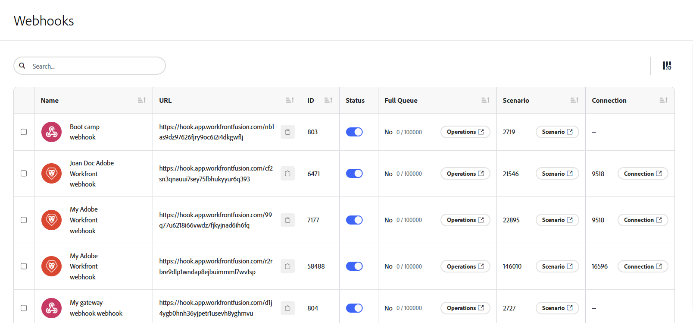

# Instant triggers (webhaken)

Veel services bieden websites voor het direct verzenden van meldingen wanneer zich een bepaalde wijziging (gebeurtenis) in de service voordoet. Om deze gebeurtenissen te verwerken, raden we u aan om onmiddellijk triggers te gebruiken. Met instant-triggers wordt de tag `Instant` weergegeven in de lijst met modules voor een bepaalde connector.

>[!TIP]
>
>U kunt de lijst van modules in een schakelaar controleren om te zien of heeft het een onmiddellijke trekker, of u kunt controleren dat de documentatie van de schakelaar onder [&#x200B; toepassingen van de Fusie en hun moduleverwijzingen &#x200B;](/help/workfront-fusion/references/apps-and-modules/apps-and-modules-toc.md) is.
>
>Voor Adobe Workfront onmiddellijke trekkerdocumentatie, zie [&#x200B; Trekkers &#x200B;](/help/workfront-fusion/references/apps-and-modules/adobe-connectors/workfront-modules.md#triggers) in de modules van artikelWorkfront.

Als een connector geen webhaak bevat, kunt u een van de volgende handelingen uitvoeren:

* Maak een aangepaste webhaak met de module Webhaak.
Voor meer informatie, zie [&#x200B; Webhooks &#x200B;](/help/workfront-fusion/references/apps-and-modules/universal-connectors/webhooks-updated.md).
* Gebruik opiniepeilingtriggers om de service periodiek te opvragen.
Voor meer informatie, zie [&#x200B; Plan een scenario &#x200B;](/help/workfront-fusion/create-scenarios/config-scenarios-settings/schedule-a-scenario.md)

Ga voor een video-introductie over websites in Workfront Fusion naar:

* [&#x200B; Intro aan Webhooks &#x200B;](https://video.tv.adobe.com/v/3427025/){target=_blank}
* [&#x200B; intermediaire Webhooks &#x200B;](https://video.tv.adobe.com/v/3427030/){target=_blank}

## Gegevens van webhaak weergeven

U kunt een lijst met webhaken weergeven in het gebied Webhooks.

1. Om het gebied van Webhooks te openen, klik het pictogram Webhooks  in de linkernavigatie.

   Hier zie je een lijst met webhaken.

   

1. Als u naar een specifieke webhaak wilt zoeken, typt u uw zoekterm in het vak Zoeken.
1. Om een webhaak te kopiëren, klik het pictogram van het Exemplaar  dichtbij URL in de rij voor die webhaak.
1. Als u een webhaak wilt in- of uitschakelen, schakelt u de schakeloptie in de kolom Status in de rij voor die webhaak in of uit.
1. Om te zien of een webhooks wachtrij vol is, controleert u de kolom Volledige wachtrij. Het aantal in deze kolom is het aantal punten momenteel in de rij.
1. Om verrichtingen te bekijken die door een webhaak worden behandeld, klik **Verrichtingen** in de Volledige kolom van de Rij voor die webhaak.
1. Controleer de kolom Verlopen om te zien of een webhaak is verlopen. Verlopen websites zijn niet gekoppeld aan een scenario of hebben gedurende 120 uur geen gebeurtenissen ontvangen.
1. Om het scenario te bekijken waar een webhaak wordt gebruikt, klik de **knoop van het Scenario** in de kolom van het Scenario voor die webhaak.
1. Om de verbinding te bekijken die voor deze webhaak wordt gebruikt, klik de **knoop van de Verbinding** in de kolom van de Verbinding voor die webhaak.
1. Om kolommen te verbergen of eerder verborgen kolommen te tonen, klik het **pictogram van Kolommen** pictogram van Kolommen 

## Instant-triggers plannen

Wanneer u een onmiddellijke trekker vormt, wordt u ertoe aangezet om te selecteren wanneer het loopt.

Selecteer `Immediately` om het scenario onmiddellijk uit te voeren wanneer Workfront Fusion nieuwe gebeurtenissen van de service ontvangt. Deze gebeurtenissen worden onmiddellijk verzonden naar een rij, en dan verwerkt in het scenario één voor één, in de zelfde orde dat de gegevens worden ontvangen.

Wanneer het scenario uitvoert, wordt de totale hoeveelheid hangende gebeurtenissen die in de rij wachten geteld, en het scenario voert zo vele cycli uit aangezien er gebeurtenissen in behandeling zijn, verwerkend één gebeurtenis per cyclus.

Voor meer informatie over cycli, zie [&#x200B; uitvoering Scenario, cycli, en fasen &#x200B;](/help/workfront-fusion/references/scenarios/scenario-execution-cycles-phases.md).

>[!NOTE]
>
>* Een cyclus is niet het zelfde als een scenario looppas. Er kunnen meerdere cycli binnen één scenario lopen.
>* Wanneer u een scenario uitvoert met een directe trigger die is gepland om te worden uitgevoerd `Immediately` , zijn de volgende uitzonderingen van toepassing:
>
>     * Het interval tussen twee uitvoeringen is niet onderworpen aan het minimuminterval volgens het prijzenplan.
>
>       Als het scenario bijvoorbeeld eenmaal is uitgevoerd, wordt de wachtrij van de webhaak opnieuw gecontroleerd. Als er websites in behandeling zijn, wordt het scenario onmiddellijk opnieuw uitgevoerd en worden alle webhooks in behandeling opnieuw verwerkt.
>   
>     * De instelling Maximum aantal cyclusscenario&#39;s wordt genegeerd en ingesteld op 100. Dit betekent dat er maximaal 100 webhaken in behandeling worden verwerkt tijdens één uitvoering van het scenario (met een snelheid van 1 gebeurtenis per cyclus).
>

Als u een andere planningsinstelling gebruikt dan [!UICONTROL Immediately] , wordt het scenario uitgevoerd met de opgegeven intervallen. Omdat er tijdens het interval meerdere webhooks in de wachtrij kunnen worden opgehaald, raden we u aan de optie [!UICONTROL Maximum number of cycles] in te stellen op een hogere waarde dan de standaardwaarde 1 om meer webhooks in één scenario uit te voeren:

1. Klik het [!UICONTROL Scenario settings] pictogram van de de montagespictogram van het pictogram  bij de bodem van uw scenario.
1. Voer in het deelvenster **[!UICONTROL Scenario settings]** dat wordt weergegeven een getal in het veld **[!UICONTROL Max number of cycles]** in om het aantal gebeurtenissen in de wachtrij aan te geven dat u wilt uitvoeren telkens wanneer u het scenario uitvoert.

De gebeurtenissen die in de rij blijven zullen worden verwerkt volgende tijd het scenario in werking wordt gesteld, tot het aantal dat in het Max aantal cyclusgebied wordt geplaatst.

## Webhaak-instructies

Voor goede prestaties beschikt Workfront Fusion over de volgende instructies voor webhaken.

### Maximumtarieven

De huidige tarieflimiet is 5 webhaken per seconde. Als de limiet wordt overschreden, wordt een `429` -statuscode geretourneerd.

### Verlopen van inactieve webhaken

Een webhaak die langer dan 120 uur niet aan een scenario is toegewezen, wordt verwijderd.

### WebHaaklading

Workfront Fusion slaat de payloads op de webhaak gedurende 30 dagen op. Als u meer dan 30 dagen nadat de payload is gemaakt, toegang krijgt tot een webhaakpayload, treedt de fout op [!UICONTROL `Failed to read file from storage.`] .

### Foutafhandeling

Wanneer er een fout in uw scenario met een onmiddellijke trekker is, het scenario:

* Stopt onmiddellijk wanneer het scenario wordt geplaatst om [!UICONTROL Immediately] in werking te stellen.
* Stopt na 3 mislukte pogingen (3 fouten) wanneer het scenario wordt geplaatst om zoals gepland te lopen.

Als een fout tijdens de scenariouitvoering voorkomt, wordt de gebeurtenis terug geplaatst in de rij tijdens de het terugschroeven van prijzenfase van de instant trekker. In een dergelijke situatie, kunt u het scenario bevestigen en het opnieuw in werking stellen.

Voor meer informatie, zie [&#x200B; Terugkeer &#x200B;](/help/workfront-fusion/references/scenarios/scenario-execution-cycles-phases.md#rollback) in de uitvoering van het artikelScenario, cycli, en fasen.

Als er een module van de Reactie van de Webhaak in uw scenario is, wordt de fout verzonden naar de reactie van de Webhaak. De WebHaak reactiemodule wordt altijd als laatste uitgevoerd (wanneer de optie [!UICONTROL Auto commit] in de Scenario-instellingen niet is ingeschakeld).

Voor meer informatie, zie [&#x200B; Reagerend aan webhooks &#x200B;](/help/workfront-fusion/references/apps-and-modules/universal-connectors/webhooks-updated.md#responding-to-webhooks) in het artikel Webhooks.

### Webhaak-deactivering

Webhaken worden automatisch gedeactiveerd als een van de volgende twee situaties van toepassing is:

* De webhaak is langer dan vijf dagen niet verbonden met een scenario.
* De webhaak wordt alleen gebruikt in inactieve scenario&#39;s, die al meer dan 30 dagen inactief zijn.

gedeactiveerde webhaken worden automatisch verwijderd en niet geregistreerd als ze niet zijn aangesloten op scenario&#39;s en meer dan 30 dagen in de gedeactiveerde status zijn geweest.

## Aangepaste webhaken

U kunt uw eigen websites maken. Voor meer informatie, zie [&#x200B; Webhooks &#x200B;](/help/workfront-fusion/references/apps-and-modules/universal-connectors/webhooks-updated.md).

## Bronnen

Voor meer informatie over cycli, zie [&#x200B; uitvoering Scenario, cycli, en fasen &#x200B;](/help/workfront-fusion/references/scenarios/scenario-execution-cycles-phases.md).
