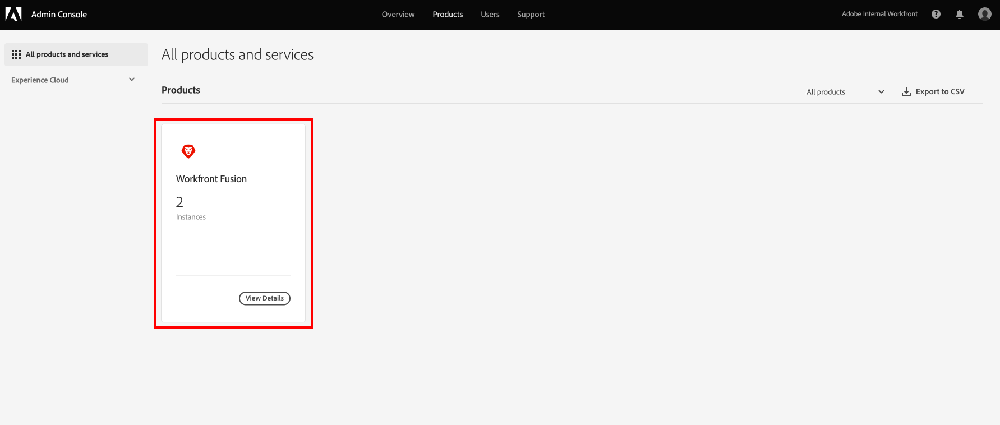

# Gebruikers aan Adobe Workfront Fusion toevoegen via de Adobe Admin Console

U kunt een gebruiker aan [!DNL Adobe Admin Console] toevoegen en hen toewijzen aan Adobe Workfront Fusion, of een bestaande gebruiker in [!DNL Adobe Admin Console] toewijzen aan Workfront Fusion.

Voor een video die de Fusie van Workfront in [!DNL Adobe Admin Console] beschrijft, met inbegrip van hoe te om gebruikers toe te voegen, zie [[!DNL Fusion]  op Adobe IMS &#x200B;](https://video.tv.adobe.com/v/3412464/){target=_blank}.

U moet de volgende toegang hebben om de functionaliteit in dit artikel te kunnen gebruiken:

<table style="table-layout:auto"> 
 <col> 
 <col> 
 <tbody> 
  <tr> 
   <td role="rowheader">Adobe Workfront-abonnement*</td> 
   <td> 
[!UICONTROL Pro] of hoger
 </td> 
  </tr> 
  <tr data-mc-conditions=""> 
   <td role="rowheader">Adobe Workfront-licentie*</td> 
   <td> 
[!UICONTROL Plan], [!UICONTROL Work]
 </td> 
  </tr> 
  <tr> 
   <td role="rowheader">Adobe Workfront Fusion-licentie**</td> 
   <td>
   
Huidige vergunningsvereiste: geen Workfront Fusion-vergunningsvereiste.

   
of

   
Vereiste voor oudere licenties: [!UICONTROL Workfront Fusion for Work Automation and Integration] 

   </td> 
  </tr> 
  <tr> 
   <td role="rowheader">Product</td> 
   <td>
   
Huidige productvereiste: als u het [!UICONTROL Select] - of [!UICONTROL Prime] Adobe Workfront-abonnement hebt, moet uw organisatie zowel Adobe Workfront Fusion als Adobe Workfront aanschaffen om de in dit artikel beschreven functionaliteit te kunnen gebruiken. Workfront Fusion is opgenomen in het Workfront-plan van [!UICONTROL Ultimate] .

   
of

   
Vereiste verouderd product: uw organisatie moet Adobe Workfront Fusion en Adobe Workfront aanschaffen om de in dit artikel beschreven functionaliteit te kunnen gebruiken.

   </td> 
  </tr>
   <tr> 
   <td role="rowheader">[!DNL Adobe] beheerdersrechten</td> 
   <td>U moet een [!UICONTROL Product Configuration Administrator] van [!DNL Adobe] producten voor uw organisatie zijn.</td> 
  </tr>
  </tbody> 
</table>

&#42; om te weten te komen welk plan, vergunningstype, of toegang u hebt, contacteer uw beheerder van Workfront.

&#42;&#42; voor informatie over de vergunningen van de Fusie van Adobe Workfront, zie [&#x200B; de vergunningen van de Fusie van Adobe Workfront &#x200B;](/help/workfront-fusion/set-up-and-manage-workfront-fusion/licensing-operations-overview/license-automation-vs-integration.md).

## Toegangsvereisten

+++ Breid uit om de toegangseisen voor de functionaliteit in dit artikel weer te geven.

U moet de volgende toegang hebben om de functionaliteit in dit artikel te kunnen gebruiken:

<table style="table-layout:auto">
 <col> 
 <col> 
 <tbody> 
  <tr> 
   <td role="rowheader">Adobe Workfront-pakket</td> 
   <td> 
Alle
 </td> 
  </tr> 
  <tr data-mc-conditions=""> 
   <td role="rowheader">Adobe Workfront-licentie</td> 
   <td> 
Nieuw: Standaard

of

Huidig: [!UICONTROL Work] of hoger
 </td> 
  </tr> 
  <tr> 
   <td role="rowheader">Adobe Workfront Fusion-licentie**</td> 
   <td>
   
Huidig: Geen Workfront Fusion-licentievereisten.

   
of

   
Verouderd: alle 

   </td> 
  </tr> 
  <tr> 
   <td role="rowheader">Product</td> 
   <td>
   
Nieuw:
 <ul><li>[!UICONTROL Select] of [!UICONTROL Prime] Workfront-abonnement: uw organisatie moet Adobe Workfront Fusion aanschaffen.</li><li>[!UICONTROL Ultimate] Workfront-abonnement: Workfront Fusion is inbegrepen.</li></ul>
   
of

   
Huidig: Uw organisatie moet Adobe Workfront Fusion aanschaffen.

   </td> 
  </tr>
  <tr data-mc-conditions=""> 
   <td role="rowheader">Configuraties op toegangsniveau*</td> 
   <td> 
     
U moet een Workfront Fusion-beheerder zijn voor uw organisatie.

     
U moet een Workfront Fusion-beheerder zijn voor uw team.

   </td> 
  </tr> 
   </td> 
  </tr> 
 </tbody> 
</table>

Voor meer detail over de informatie in deze lijst, zie [&#x200B; vereisten van de Toegang in documentatie &#x200B;](/help/workfront-fusion/references/licenses-and-roles/access-level-requirements-in-documentation.md).

Voor informatie over de vergunningen van de Fusie van Adobe Workfront, zie [&#x200B; de Fusie van Adobe Workfront vergunningen &#x200B;](/help/workfront-fusion/set-up-and-manage-workfront-fusion/licensing-operations-overview/license-automation-vs-integration.md).

+++

## Vereisten

Voordat u [!DNL Admin Console] for Workfront gebruikt, ontvangt u een e-mail met de uitnodiging aan de console.

1. Als u [!DNL Adobe] nog niet eerder hebt gebruikt en u een e-mail hebt ontvangen waarin u wordt gemeld dat u nu beheerrechten hebt voor [!DNL Adobe] -software en -services voor uw organisatie, klikt u op de knop in de e-mail om een [!DNL Adobe] -account te maken en opent u [!DNL Admin Console] .

   of

   Als u reeds een rekening van Adobe hebt, ga naar de [[!DNL Adobe Admin Console]  pagina &#x200B;](https://adminconsole.adobe.com).

## Een nieuwe gebruiker toevoegen aan [!DNL Adobe Admin Console] en Workfront Fusion

1. Van de [[!DNL Adobe Admin Console]  pagina &#x200B;](https://adminconsole.adobe.com/), selecteer het **[!UICONTROL Products]** lusje in de hoogste navigatiebar, en selecteer dan de **de Fusie van Workfront** producttegel.

   

1. Selecteer in de lijst die wordt weergegeven de organisatie waaraan u een gebruiker wilt toevoegen.

   

1. Klik in de lijst die wordt weergegeven met het tabblad **[!UICONTROL Product Profiles]** geselecteerd op de naam van de Workfront Fusion [!UICONTROL Product Profile] -koppeling.

   >[!IMPORTANT]
   >
   > Breng geen wijzigingen aan in de [!UICONTROL Product Profile] zelf.

1. Selecteer de tab **[!UICONTROL Users]** boven de lijst en klik op **[!UICONTROL Add User]** .

1. Voer in het vak **[!UICONTROL Add users to this product profile]** het e-mailadres of de naam in van de gebruiker die u wilt toevoegen en selecteer vervolgens de gebruiker in de lijst die wordt weergegeven.

1. Klik op **[!UICONTROL Save]**.

   De gebruiker wordt gemaakt in Workfront Fusion.

1. (Optioneel) Ga door met [&#x200B; Toegangsniveau van een gebruiker wijzigen in Workfront Fusion &#x200B;](#change-a-users-access-level-in-workfront-fusion)

## Het toegangsniveau van een gebruiker wijzigen in Workfront Fusion

* [De rol van een gebruiker wijzigen in Beheerder](#change-a-users-role-to-admin)
* [De rol van een gebruiker wijzigen in Lid, Accountant of App Developer](#change-a-users-role-to-member-accountant-or-app-developer)

### De rol van een gebruiker wijzigen in Beheerder

Het geven van een gebruiker een Admin rol moet in [!DNL Adobe Admin Console] worden gedaan.

1. Selecteer de tab [!UICONTROL Product Profile] op de Workfront Fusion **[!UICONTROL Admins]** -pagina waar u de gebruiker hebt toegevoegd.

1. Klik op **[!UICONTROL Add Admin]**.

1. Voer in het vak **[!UICONTROL Add product profile administrators]** het e-mailadres of de naam in van de gebruiker die u als beheerder wilt instellen en selecteer vervolgens de gebruiker in de lijst die wordt weergegeven.

1. Klik op **[!UICONTROL Save]**.

   De gebruiker is nu Beheerder in Workfront Fusion.

### De rol van een gebruiker wijzigen in Lid, Accountant of App Developer

De rollen Lid, Accountant, en App Developer worden behandeld binnen Workfront Fusion.

Voor instructies, zie [&#x200B; Mening of geef gebruikersrollen &#x200B;](/help/workfront-fusion/set-up-and-manage-workfront-fusion/set-up-and-manage-orgs-and-teams/manage-users-and-teams/view-or-edit-user-roles.md) uit.

## Bestaande gebruikers in de [!DNL Adobe Admin Console] toewijzen aan Workfront Fusion

U kunt een bestaande gebruiker aan een team in Fusion toevoegen. Dit wordt afgehandeld in Fusion.

Voor instructies, zie [&#x200B; een gebruiker aan een team &#x200B;](/help/workfront-fusion/set-up-and-manage-workfront-fusion/set-up-and-manage-orgs-and-teams/set-up-orgs-teams-and-users/add-a-user-to-a-team.md) toevoegen.
